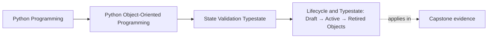

# Lifecycle and Typestate: Draft → Active → Retired Objects


<!-- page-maps:start -->
## Page Maps




<!-- page-maps:end -->

Read the first diagram as a placement map: this page is one concept inside its parent module, not a detached essay, and the capstone is the pressure test for whether the idea holds. Read the second diagram as the working rhythm for the page: name the problem, study the example, identify the boundary, then carry one review question forward.

## Purpose

Model lifecycle explicitly as a **state machine** so your codebase can enforce “what operations are allowed when”.

You will learn:
- how to represent typestate (distinct types vs state field),
- how to define legal transitions,
- and how to test lifecycle correctness.

## Where This Fits

Running example: a monitoring service that fetches metrics, evaluates rules, and emits alerts. In earlier modules we refactored toward a layered design (domain/application/infrastructure) with explicit roles. From M03 onward, we tighten *data integrity* and *lifecycle semantics* so the system stays correct under change.

## 1. Typestate: The Contract Depends on State

A rule in our monitoring system has phases:

- **Draft**: defined but not evaluated.
- **Active**: evaluated on every cycle.
- **Retired**: preserved for history but not evaluated.

Each phase has different allowed operations and required data.

If you model all phases with one class and a `state` field, you invite invalid combos:
- `state=ACTIVE` but `activated_at=None`.

Typestate says: **different state, different type (often)**.

## 2. Two Representations: Field-Based vs Type-Based

### 2.1 Field-based (one class + enum)

Pros:
- fewer classes,
- easy serialization.

Cons:
- invariants are conditional,
- runtime checks everywhere.

### 2.2 Type-based (recommended)

Pros:
- invariants are structural (unrepresentable invalid states),
- method signatures can enforce allowed operations.

Cons:
- more types,
- conversion between states must be explicit.

For pedagogy and correctness, type-based typestate is usually superior in Python.

## 3. A Minimal State Machine for Rules

Define legal transitions:

- `DraftRule.activate(...) -> ActiveRule`
- `ActiveRule.retire(...) -> RetiredRule`

No other transitions exist.

```python
from dataclasses import dataclass
import time

@dataclass(frozen=True, slots=True)
class DraftRule:
    metric: MetricName
    threshold: Threshold

    def activate(self, rule_id: str) -> "ActiveRule":
        return ActiveRule(rule_id, self.metric, self.threshold, activated_at=time.time())

@dataclass(frozen=True, slots=True)
class ActiveRule:
    rule_id: str
    metric: MetricName
    threshold: Threshold
    activated_at: float

    def retire(self, reason: str) -> "RetiredRule":
        return RetiredRule(self.rule_id, self.metric, retired_reason=reason)

@dataclass(frozen=True, slots=True)
class RetiredRule:
    rule_id: str
    metric: MetricName
    retired_reason: str
```

Now “active implies activated_at exists” is structurally guaranteed.

## 4. Testing Transitions and Illegal Operations

Test both:
- correct transitions,
- and impossible operations (which should not exist).

Example tests:
- Draft can activate → Active.
- Active can retire → Retired.
- Retired has no `.activate()` method (type system + runtime prevents it).

Even without static typing, the absence of methods is a real enforcement mechanism.

## Practical Guidelines

- Use typestate when lifecycle affects allowed operations or required fields.
- Prefer type-based typestate for domain clarity; keep serialization in infrastructure.
- Make transitions explicit methods returning the next-state type.
- Write tests for transitions and ensure invalid combos are unconstructable.

## Exercises for Mastery

1. Implement Draft/Active/Retired types for one domain entity. Ensure you cannot create an Active instance without required fields.
2. Add a new lifecycle phase (e.g., `PausedRule`) and define legal transitions. Update tests.
3. Write a unit test that proves retired rules are not evaluated in the orchestrator.
