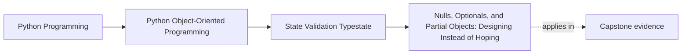
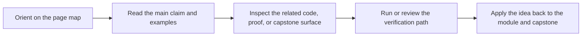

# Nulls, Optionals, and Partial Objects: Designing Instead of Hoping


<!-- page-maps:start -->
## Page Maps




<!-- page-maps:end -->

Read the first diagram as a placement map: this page is one concept inside its parent module, not a detached essay, and the capstone is the pressure test for whether the idea holds. Read the second diagram as the working rhythm for the page: name the problem, study the example, identify the boundary, then carry one review question forward.

## Purpose

Stop letting `None` leak into your core model.

This core teaches how to represent absence *deliberately*:
- by separating “missing at the boundary” from “missing in the domain”,
- by using typestates, sentinels, and explicit results instead of `Optional` everywhere.

## Where This Fits

Running example: a monitoring service that fetches metrics, evaluates rules, and emits alerts. In earlier modules we refactored toward a layered design (domain/application/infrastructure) with explicit roles. From M03 onward, we tighten *data integrity* and *lifecycle semantics* so the system stays correct under change.

## 1. `None` Is Not a Design, It’s an Unspecified State

`None` can mean many things:
- not provided,
- unknown,
- not loaded yet,
- not applicable,
- intentionally absent.

When `None` reaches your domain layer, your code becomes ambiguous and error-prone.

Teaching rule:
> If `None` appears in domain collections (`list[Optional[T]]`), you have already lost clarity.

## 2. Keep Optionality at the Boundary

Boundary layers deal with missing fields naturally.

Inside the domain, prefer:
- “no such object” → raise `NotFound` / return `Result`,
- “not applicable” → different type / different method,
- “not loaded” → explicit state or a lazy loader object (rare; treat as infrastructure).

Example: parsing config may yield missing `window_seconds`, but the domain `Window` should never be optional if rules require it.

## 3. Three Better Patterns Than `Optional`

### 3.1 Typestate types (preferred)

Instead of `activated_at: float | None`, use `DraftRule` vs `ActiveRule` (M03C28).

### 3.2 Explicit sentinel for “not provided”

```python
_MISSING = object()

def parse_threshold(value=_MISSING):
    if value is _MISSING:
        ...
```

This is useful in parsing code where `None` could be a valid value.

### 3.3 Result objects for lookups

Instead of returning `None` from lookups:

```python
class RuleNotFound(Exception): ...

def get_rule(rule_id) -> Rule:
    ...
```

or return a small `Result` type. The important part is: absence is explicit.

## 4. Partial Objects Are a Smell

A “partial object” is an instance that exists but is not valid yet.

Example:
- `Rule(metric=None, threshold=None)` created then filled later.

This creates an invalid intermediate state and forces every method to handle it.

Replace with:
- a builder/factory that produces a valid object at the end, or
- a separate `DraftRule` type, which is valid by its own contract (just a different contract).

## Practical Guidelines

- Do not store `None` inside domain collections or core graphs unless `None` has a precise, documented meaning.
- Use typestate types to represent lifecycle phases (Draft/Active/Retired).
- Use exceptions or `Result` to represent missing objects; avoid `Optional` returns for required lookups.
- Use sentinels only in parsing/boundary code where `None` itself may be meaningful.

## Exercises for Mastery

1. Find an `Optional[...]` in your domain model. Replace it with either a typestate type or an explicit result.
2. Remove a `list[Optional[T]]` by changing the API so the list is always `list[T]` and absence is handled earlier.
3. Implement `RuleNotFound` and refactor one lookup to stop returning `None`.
