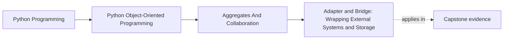
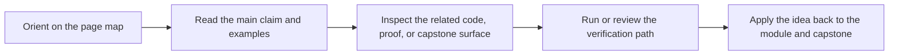

# Adapter and Bridge: Wrapping External Systems and Storage


<!-- page-maps:start -->
## Page Maps




<!-- page-maps:end -->

## Purpose

Wrap external systems (APIs, databases, queues) behind stable interfaces so your domain stays clean.

This core reinforces:
- ports/adapters (Module 2),
- and adds two classic structural patterns:
  - **Adapter**: make one interface look like another,
  - **Bridge**: separate abstraction from implementation so they can vary independently.

## Where This Fits

Running example: a monitoring service that fetches metrics, evaluates rules, and emits alerts. In earlier modules we refactored toward a layered design (domain/application/infrastructure) with explicit roles. From M03 onward, we tighten *data integrity* and *lifecycle semantics* so the system stays correct under change.

## 1. Adapter: Translate an External Interface Into Your Port

Suppose your domain wants:

```python
class MetricFetcherPort(Protocol):
    def fetch(self, name: MetricName) -> float: ...
```

But the external API provides `get_metric(str) -> dict`.

The adapter translates:

- input type (`MetricName` → `str`)
- output shape (`dict` → `float`)
- error mapping (timeout → `MetricFetchError`)

## 2. Bridge: Swap Implementations Without Changing the Abstraction

A bridge is useful when you have multiple implementations:

- `HttpMetricFetcher`
- `FileMetricFetcher`
- `FakeMetricFetcher` (tests)

The abstraction stays stable (`MetricFetcherPort`), and implementations vary.

In Python, “bridge” often just means “depend on a protocol and inject the implementation” — exactly what Module 2 taught.

## 3. Error Mapping Is Part of the Adapter

External exceptions should not leak into the domain.

- requests raises `Timeout`
- database raises `OperationalError`

Adapters should catch and raise your own stable errors:
- `MetricFetchUnavailable`
- `StorageUnavailable`

This keeps error handling teachable and consistent (M05C45).

## 4. Testing: Fakes First, Adapters Second

- Domain/application tests use fakes implementing the port.
- Adapter tests verify translation and error mapping.

Do not test your whole system by hitting the real external service. That is an integration test, not your default unit test.

## Practical Guidelines

- Define ports (protocols) in the application/domain; implement adapters in infrastructure.
- Adapters translate types, shapes, and errors. Don’t leak external exceptions inward.
- Use injection to swap implementations (bridge-style).
- Test with fakes for domain/application; test adapters separately with small contract tests.

## Exercises for Mastery

1. Write a `MetricFetcherPort` and a fake implementation used in unit tests.
2. Implement an adapter around an external client and test its error mapping.
3. Add a second implementation (e.g., cache-backed) without changing callers.
