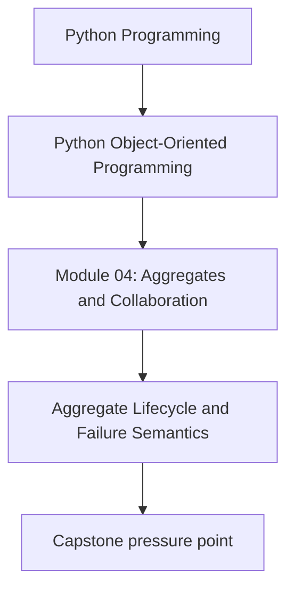
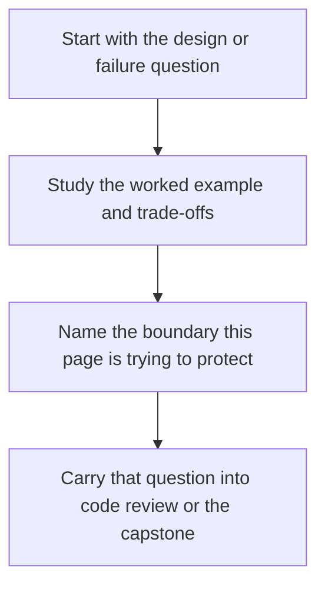

# Aggregate Lifecycle and Failure Semantics

<!-- page-maps:start -->
## Concept Position

<!-- page-maps:end -->

Read the first diagram as a placement map: this page is one concept inside its parent module, not a detached essay, and the capstone is the pressure test for whether the idea holds. Read the second diagram as the working rhythm for the page: name the problem, study the example, identify the boundary, then carry one review question forward.

## Purpose

Define how aggregates behave under failure: conflicts, partial updates, and “what does it mean to be correct after an error?”

This core gives you a vocabulary for designing *atomic-looking* domain operations in a non-atomic language/runtime.

## Where This Fits

Running example: a monitoring service that fetches metrics, evaluates rules, and emits alerts. In earlier modules we refactored toward a layered design (domain/application/infrastructure) with explicit roles. From M03 onward, we tighten *data integrity* and *lifecycle semantics* so the system stays correct under change.

## 1. Domain Operations Should Be Atomic in Meaning

An operation like “retire a rule” should either:
- succeed completely, or
- fail without changing the aggregate.

Even in Python (without transactions), you can design for atomic meaning by:
- computing changes first,
- then applying them in a small, non-failing block,
- or using immutable replacements (common with frozen dataclasses).

## 2. Versioning and Optimistic Concurrency (Conceptual)

If aggregates are persisted, two writers can race.

A common pattern:
- aggregates have a `version` number,
- repository save checks the expected version,
- if mismatch, raise `ConcurrencyConflict`.

Even if you don’t implement it now, teaching it helps learners reason about correctness under concurrency.

## 3. Failure Taxonomy: Domain vs Infrastructure

Classify failures:

- **Domain failures**: invariant violation, not found, illegal transition.
  - These should be deterministic and testable.
- **Infrastructure failures**: I/O errors, timeouts, storage unavailable.
  - These are environmental and must be handled at the application boundary.

Your domain objects should not swallow infrastructure failures; they should not depend on I/O.

## 4. Designing “No Partial Update” in Mutable Aggregates

If your aggregate is mutable, you can still avoid partial updates:

Pattern:
1. Find the target objects and validate preconditions.
2. Build the next-state objects.
3. Apply mutations.

Example for retire:
- locate active rule,
- create `RetiredRule`,
- remove active rule,
- append retired rule,
- update indexes.

Ensure mutations in step 3 cannot raise (e.g., avoid code that can fail there).

## 5. Tests: Failures Must Leave State Unchanged

Write tests that prove failure does not partially mutate the aggregate:

- retiring a missing rule raises `RuleNotFound` and leaves collections unchanged.
- adding a duplicate raises `DuplicateRuleId` and leaves collections unchanged.

These tests are “behavioral transactions” even without a database transaction.

## Practical Guidelines

- Treat domain operations as atomic in meaning: succeed completely or not at all.
- Separate domain errors from infrastructure errors; handle infrastructure at the edge.
- Consider aggregate versioning for persistence and concurrency; even if later, design for it now.
- Write tests ensuring failed operations do not partially mutate aggregate state.

## Exercises for Mastery

1. Add a `version` field to your aggregate and sketch an optimistic concurrency check in the repository.
2. Write a test that proves `retire_rule` leaves state unchanged when it fails.
3. Classify your existing exceptions into domain vs infrastructure. Refactor one misclassified case.
