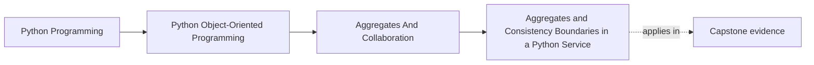
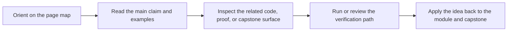

# Aggregates and Consistency Boundaries in a Python Service


<!-- page-maps:start -->
## Page Maps




<!-- page-maps:end -->

## Purpose

Move from “a pile of objects” to a **coherent domain boundary**.

An *aggregate* is a cluster of objects treated as one unit for consistency. In Python services, aggregates keep invariants enforceable without spreading checks everywhere.

## Where This Fits

Running example: a monitoring service that fetches metrics, evaluates rules, and emits alerts. In earlier modules we refactored toward a layered design (domain/application/infrastructure) with explicit roles. From M03 onward, we tighten *data integrity* and *lifecycle semantics* so the system stays correct under change.

## 1. The Problem Aggregates Solve

As the system grows, invariants often span multiple objects:

- rule IDs must be unique within a policy,
- you must not have two active rules with the same `(metric, window)` pair,
- retiring a rule should update indexes and projections consistently.

Without an aggregate boundary, you enforce these rules in scattered places:
- orchestrator,
- repository,
- UI handler,
- random helper functions.

That is how invariants rot.

## 2. Define an Aggregate Root

Pick one object as the **aggregate root**:
- the only entry point for modifications,
- the one that enforces cross-object invariants.

Example: `MonitoringPolicy` (or `RuleSet`) as root.

```python
from dataclasses import dataclass, field

@dataclass(slots=True)
class MonitoringPolicy:
    policy_id: str
    active_rules: list[ActiveRule] = field(default_factory=list)
    retired_rules: list[RetiredRule] = field(default_factory=list)

    def add_active_rule(self, rule: ActiveRule) -> None:
        # enforce invariants here (see M04C32)
        self.active_rules.append(rule)

    def retire_rule(self, rule_id: str, reason: str) -> None:
        ...
```

Teaching rule:
> If you can mutate children without the root knowing, you don’t have an aggregate.

## 3. Repository Boundaries

Aggregates often map to repository operations:

- load aggregate by ID,
- modify via root methods,
- save aggregate atomically.

In pure Python, “atomic” might mean “one write to storage” or “one transaction”.

This ties directly to Unit-of-Work (M05C42).

## 4. What Aggregates Are Not

Aggregates are not:
- “all objects in the system”
- “a deep tree of everything related”
- “a replacement for modules”

Keep aggregates small. If you frequently need two aggregates at once to enforce invariants, you probably chose the wrong boundaries.

## Practical Guidelines

- Choose aggregate roots around invariants that must be consistent together.
- Enforce cross-object invariants only at the root (not scattered).
- Keep aggregates small; avoid “one aggregate to rule them all”.
- Access and mutation should flow through root methods.

## Exercises for Mastery

1. Identify one cross-object invariant in your project. Create an aggregate root that enforces it.
2. Refactor a scattered invariant check (spread across functions) into a single root method + tests.
3. Define repository operations for the aggregate (load/save) and write a simple fake repository for tests.
