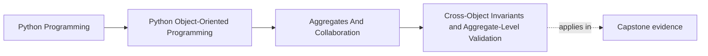
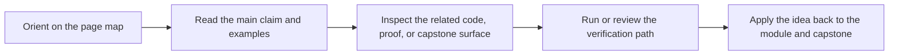

# Cross-Object Invariants and Aggregate-Level Validation


<!-- page-maps:start -->
## Page Maps




<!-- page-maps:end -->

## Purpose

Implement invariants that involve *relationships between objects*.

In Module 3 we made single-object invariants unrepresentable. Now we enforce **multi-object** invariants at the aggregate boundary.

## Where This Fits

Running example: a monitoring service that fetches metrics, evaluates rules, and emits alerts. In earlier modules we refactored toward a layered design (domain/application/infrastructure) with explicit roles. From M03 onward, we tighten *data integrity* and *lifecycle semantics* so the system stays correct under change.

## 1. Examples of Cross-Object Invariants

In a monitoring policy:

- No two active rules may share the same `rule_id`.
- No two active rules may target the same `(metric, threshold, window)` if your business rules require uniqueness.
- A rule cannot be both active and retired.
- Retiring a rule must remove it from the active collection.

These invariants involve *multiple* objects and collections.

## 2. Enforce Invariants in Root Methods, Not Callers

Instead of “callers check then call add”, the root should own the check:

```python
class DuplicateRuleId(Exception): ...

def add_active_rule(self, rule: ActiveRule) -> None:
    if any(r.rule_id == rule.rule_id for r in self.active_rules):
        raise DuplicateRuleId(rule.rule_id)
    self.active_rules.append(rule)
```

This prevents “forgot to check” bugs and makes the invariant testable in one place.

## 3. Maintain Indexes for Performance (But Keep Them Correct)

For large aggregates, `any(...)` becomes slow. Use indexes, but update them *together* with the collections:

```python
from dataclasses import dataclass, field

@dataclass(slots=True)
class MonitoringPolicy:
    active_rules: list[ActiveRule] = field(default_factory=list)
    _active_by_id: dict[str, ActiveRule] = field(default_factory=dict, init=False, repr=False)

    def add_active_rule(self, rule: ActiveRule) -> None:
        if rule.rule_id in self._active_by_id:
            raise DuplicateRuleId(rule.rule_id)
        self.active_rules.append(rule)
        self._active_by_id[rule.rule_id] = rule
```

Now you must ensure:
- every mutation keeps both structures in sync.
- tests cover sync behavior (this is a high-value invariant test).

## 4. Aggregate Validation: Construction vs Mutation

You can enforce invariants:
- **at construction** (when loading from storage),
- and **on mutation** (when applying commands).

Loading from storage is a boundary concern:
- read raw data,
- reconstruct aggregate,
- validate it once,
- reject corrupted persisted state early.

This is the “fail fast on bad history” principle.

## Practical Guidelines

- Put cross-object invariants in aggregate root methods, not scattered across callers.
- Use explicit domain exceptions for invariant violations (they become part of the contract).
- If you add indexes for performance, treat index consistency as an invariant with tests.
- Validate aggregates on load from storage; don’t silently accept corrupted history.

## Exercises for Mastery

1. Add a uniqueness invariant to your aggregate and test it.
2. Add a dict index to speed lookups. Write a test that proves the index stays in sync after add/retire operations.
3. Simulate loading a corrupted aggregate from storage and ensure validation fails loudly.
