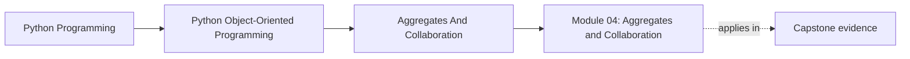
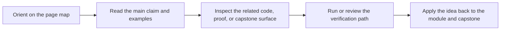

# Module 04: Aggregates and Collaboration

<!-- page-maps:start -->
## Page Maps

<!-- page-maps:end -->

Systems fail when invariants are scattered. This module shifts the focus from single
objects to coherent collaboration boundaries.

Keep one question in view while reading:

> Which object or boundary is authoritative once more than one object participates in the same rule?

That question is what separates an aggregate from a cluster of objects that merely happen
to call each other.

## Preflight

- You should already be able to name ownership boundaries and state contracts from the earlier modules.
- If event emission, projections, or policy objects still feel interchangeable, slow down before reading aggregate examples.
- Treat every collaboration example as a test of authority: who is allowed to change what, and who only derives views.

## Learning outcomes

- define aggregate boundaries that centralize cross-object invariants without collapsing into manager objects
- distinguish authoritative state, domain events, projections, policies, and adapters by responsibility
- explain how collaboration can stay explicit without letting every object know every other object
- review extension pressure without weakening the source-of-truth boundary

## Why this module matters

Once more than one object collaborates, correctness stops being a local property.
The system needs a rule for who may change what, when events are emitted, and which
downstream views are authoritative versus merely derived.

Without that discipline, teams often end up with one of two failures:

- every object reaches into every other object, so invariants dissolve into convention
- one "manager" object knows everything, so the model collapses into a disguised script

This module is about finding the boundary between those extremes.

## Main questions

- Which objects need to stay consistent together?
- Where should cross-object invariants be enforced?
- How can domain events decouple behavior without collapsing into complexity theater?
- What should a projection know, and what should it never control?
- How do objects collaborate without every class knowing every other class?

## Reading path

1. Start with aggregates and cross-object invariants.
2. Move through lifecycle and event emission before reading projections.
3. Study policies, adapters, and collaboration surfaces after the boundary is clear.
4. Use the refactor chapter as the test of whether the model stays coherent under extension.

## First capstone pass for this module

1. Read `capstone/ARCHITECTURE.md`.
2. Inspect `src/service_monitoring/model.py`.
3. Inspect `src/service_monitoring/read_models.py` and `src/service_monitoring/projections.py`.
4. Use `make inspect` or the lifecycle tests only after you can already name the authoritative boundary.

## If the module still feels blurry

- ask which object may reject a change instead of asking which object merely hears about it
- compare the aggregate with one projection and explain why only one of them may change domain truth
- compare a policy seam with orchestration and explain why variation is not the same thing as authority

## Common failure modes

- emitting events from objects that do not own the underlying invariant
- letting projections become write models in disguise
- mixing orchestration concerns into aggregates because it feels convenient
- letting adapters leak storage or transport assumptions into domain methods
- adding strategies without a stable contract, turning extension into guesswork

## Exercises

- Identify one cross-object invariant and explain which aggregate or boundary should own it.
- Review one event flow and state which artifact is authoritative and which artifact is only a downstream projection.
- Compare an aggregate design with a manager-object design and explain which one keeps invariants easier to audit.

## Capstone connection

This module is the direct explanation of the capstone's architecture. The `MonitoringPolicy`
aggregate owns registration, activation, retirement, and alert production; projections stay
downstream of events; policies encapsulate evaluation variation; and the runtime coordinates
without becoming the source of truth. Read this module as the justification for those edges.

## Honest completion signal

You are ready to move on when you can open one capstone collaboration path and answer all
three of these without guessing:

- which boundary is authoritative
- which artifact is only derived
- which extension should land outside the aggregate

## Closing criteria

You should finish this module able to design aggregate roots, projections, policies,
and adapters that preserve coherence without creating god objects.
