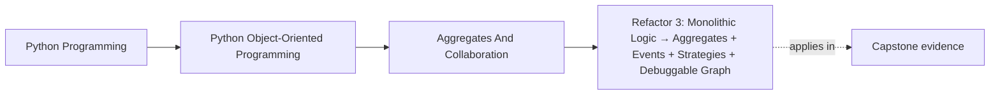
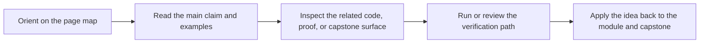

# Refactor 3: Monolithic Logic → Aggregates + Events + Strategies + Debuggable Graph

<!-- page-maps:start -->
## Page Maps

<!-- page-maps:end -->

## Goal

Restructure the monitoring system so it is:

- **aggregate-centered** (consistency enforced in one place),
- **event-capable** (decoupled reactions),
- **strategy-driven** (easy to add rule kinds),
- and **debuggable** (inspectable object graph and projections).

This refactor turns a “working blob” into a maintainable service shape.

## Where This Fits

Running example: a monitoring service that fetches metrics, evaluates rules, and emits alerts. In earlier modules we refactored toward a layered design (domain/application/infrastructure) with explicit roles. From M03 onward, we tighten *data integrity* and *lifecycle semantics* so the system stays correct under change.

## 1. Starting Smells

You are likely starting with one or more of:
- orchestrator owns everything and enforces every invariant,
- rule evaluation logic is a large conditional ladder,
- side effects are mixed with domain mutations,
- debugging requires stepping through a long loop.

We are going to separate responsibilities without losing correctness.

## 2. Target Architecture Snapshot

Target structure:

- `domain/`:
  - `types.py` (semantic values)
  - `rules.py` (typestate)
  - `policy.py` (aggregate root)
  - `events.py` (domain events)

- `application/`:
  - `services.py` (orchestrators)
  - `translate.py` (DTO → domain)
  - `ports.py` (interfaces)

- `infrastructure/`:
  - adapters (metric fetcher, storage)
  - event bus wiring
  - projections/read models

Plus tests for invariants, transitions, and wiring.

## 3. Refactor Steps

### Step 1 — Introduce an aggregate root
- Create `MonitoringPolicy` that owns active/retired rules.
- Move cross-object invariant checks into root methods.

### Step 2 — Introduce strategies for evaluation
- Define `RuleStrategy` protocol.
- Implement at least one strategy (threshold).
- Update orchestrator to call strategy, not `if/elif`.

### Step 3 — Emit domain events from aggregate operations
- On activate/retire, return events (`RuleActivated`, `RuleRetired`).

### Step 4 — Add an in-process event bus and one projection
- Implement a tiny bus (M04C35).
- Add a projection updated on events.

### Step 5 — Add debug views
- `policy.debug_view()` and/or a projection debug snapshot.

Refactor in thin slices and keep tests green.

## 4. Tests That Prove the Refactor Is Correct

- Aggregate invariant tests (duplicates, illegal retire, etc.).
- Strategy tests (pure evaluation behavior).
- Event emission tests (events only on success).
- Bus/projection tests (handler wiring, deterministic updates).
- End-to-end: orchestrator cycle produces expected alerts and debug view is coherent.

The key: tests should validate *contracts*, not internal implementation details.

## 5. “Done” Definition

You are done when:

- invariants are enforced in one aggregate root,
- adding a new rule type requires adding a strategy (not editing a ladder),
- reactions to state changes are handled via events/handlers,
- you can generate a debug view without stepping through the whole loop.

## Practical Guidelines

- Refactor by introducing new abstractions (aggregate/strategy/event) while keeping behavior unchanged.
- Keep the domain pure; wire infrastructure at the composition root.
- Use events to decouple side effects and projections from core mutations.
- Invest in debug views early; they pay back immediately in maintainability.

## Exercises for Mastery

1. Implement the aggregate root and move at least two invariants into it with tests.
2. Extract one rule evaluation path into a strategy and delete an `if/elif` branch from the orchestrator.
3. Add a projection updated from events and assert it in an integration test.
