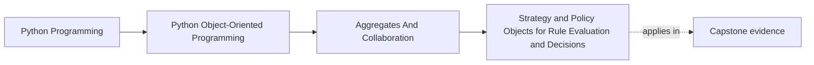
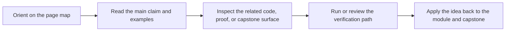

# Strategy and Policy Objects for Rule Evaluation and Decisions


<!-- page-maps:start -->
## Page Maps




<!-- page-maps:end -->

## Purpose

Extract “how we decide” into **strategy/policy objects** so you can add rule types without rewriting orchestration code.

This core is where your design becomes extensible *without* turning into a class explosion.

## Where This Fits

Running example: a monitoring service that fetches metrics, evaluates rules, and emits alerts. In earlier modules we refactored toward a layered design (domain/application/infrastructure) with explicit roles. From M03 onward, we tighten *data integrity* and *lifecycle semantics* so the system stays correct under change.

## 1. The Smell: `if/elif` Ladders for Rule Types

A common progression:

```python
if rule.kind == "threshold": ...
elif rule.kind == "rate": ...
elif rule.kind == "anomaly": ...
```

This spreads rule logic across the codebase and makes adding a new rule risky.

Instead, move the varying part behind a stable interface: a strategy.

## 2. Strategy Object: One Interface, Many Implementations

Define a small protocol:

```python
from typing import Protocol

class RuleStrategy(Protocol):
    def evaluate(self, rule: ActiveRule, metric_value: float) -> bool: ...
```

Implementations:
- `ThresholdStrategy`
- `RateStrategy`
- etc.

The orchestrator depends on `RuleStrategy`, not on each concrete kind.

## 3. Policy Objects: When Decisions Need Context

A **policy** is a strategy with more context and possibly configuration.

Example: “alert deduplication policy” that decides whether to emit a new alert given recent history.

Separate:
- evaluation strategy (does rule trigger?)
- action policy (what do we do if it triggers?)

This separation keeps objects small and teachable.

## 4. Composition Over Inheritance

Strategies are great as composable objects:

- a `ThresholdStrategy` can be wrapped by `DebouncePolicy`,
- `RetryPolicy` can wrap adapters (M05C44).

Favor composition:
- small, single-purpose objects,
- wired together in the composition root (Module 2).

## 5. Testing Strategies in Isolation

Strategies are easy to test because they are pure-ish:
- input → output
- minimal dependencies.

Write small tests per strategy.
Then write one integration test proving the orchestrator wires and uses the strategy correctly.

## Practical Guidelines

- Replace `if/elif` ladders for behavior selection with strategy objects.
- Keep strategy interfaces small; pass domain types, not raw dicts.
- Separate evaluation from action policies when decisions differ.
- Prefer composition (wrappers/decorators) over deep inheritance hierarchies.

## Exercises for Mastery

1. Extract one conditional rule evaluation path into a `RuleStrategy` implementation with tests.
2. Add a new rule kind by implementing a new strategy without modifying the orchestrator loop.
3. Write a policy wrapper that suppresses duplicate alerts within a time window.
