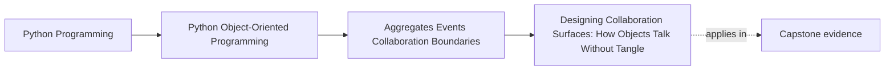
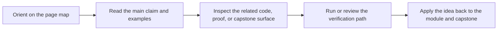

# Designing Collaboration Surfaces: How Objects Talk Without Tangle

<!-- page-maps:start -->
## Page Maps

<!-- page-maps:end -->

Read the first diagram as a placement map: this page is one concept inside its parent module, not a detached essay, and the capstone is the pressure test for whether the idea holds. Read the second diagram as the working rhythm for the page: name the problem, study the example, identify the boundary, then carry one review question forward.

## Purpose

Prevent object graphs from turning into a spaghetti bowl.

This core teaches how to design *collaboration surfaces*:
- what each object is allowed to know,
- what it must not know,
- and how to keep dependencies directional and reviewable.

## Where This Fits

Running example: a monitoring service that fetches metrics, evaluates rules, and emits alerts. In earlier modules we refactored toward a layered design (domain/application/infrastructure) with explicit roles. From M03 onward, we tighten *data integrity* and *lifecycle semantics* so the system stays correct under change.

## 1. The Tangle Smell

A tangle looks like:
- objects directly importing and calling each other in cycles,
- “helper” modules that know everyone,
- domain objects that call infrastructure services.

Symptoms:
- small change breaks unrelated modules,
- testing requires huge setups,
- circular imports.

This is not a Python problem; it’s a design problem.

## 2. Collaboration Surface = Methods + Data Shapes + Error Semantics

When object A calls object B, you have a contract:

- method signature (inputs/outputs),
- accepted types (domain vs DTO),
- error behavior (exceptions/results),
- side effects (logging, I/O, mutation).

Make these explicit:
- small interfaces (protocols),
- domain types at core,
- infrastructure hidden behind adapters.

## 3. Orchestration vs Domain Behavior

Two roles:

- **Domain objects**: contain business rules and invariants.
- **Orchestrators/services**: coordinate multiple domain objects and ports.

If domain objects start coordinating other objects, they grow into “god objects”.
If orchestrators start implementing business rules, the domain becomes anemic.

Keep the split clean.

## 4. Directional Dependencies as a Design Constraint

Use a simple rule:

- domain imports nothing from application/infrastructure,
- application imports domain,
- infrastructure imports both (but is wired at the composition root).

When this rule is violated, tangles appear. Your modules become untestable and hard to teach.

## Practical Guidelines

- Define small, explicit collaboration surfaces (ports/protocols).
- Keep domain free of I/O and infrastructure dependencies.
- Put coordination in application services; put invariants/decisions in domain objects and strategies.
- Use dependency direction as a hard constraint to prevent tangles and circular imports.

## Exercises for Mastery

1. Find a circular import in your project (or create a small example). Refactor to remove it using a protocol + injection.
2. Identify one place where an orchestrator contains business logic. Move that logic into a domain object or strategy with tests.
3. Draw (or write) the dependency graph of 5 key modules. Confirm dependencies flow inward.
