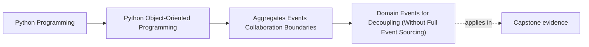
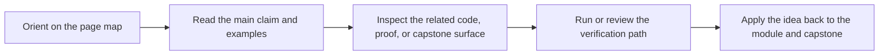

# Domain Events for Decoupling (Without Full Event Sourcing)


<!-- page-maps:start -->
## Page Maps




<!-- page-maps:end -->

Read the first diagram as a placement map: this page is one concept inside its parent module, not a detached essay, and the capstone is the pressure test for whether the idea holds. Read the second diagram as the working rhythm for the page: name the problem, study the example, identify the boundary, then carry one review question forward.

## Purpose

Use **domain events** to decouple parts of your system without adopting full event sourcing.

A domain event is a record of “something that happened” in the domain, emitted by aggregates when state changes.

## Where This Fits

Running example: a monitoring service that fetches metrics, evaluates rules, and emits alerts. In earlier modules we refactored toward a layered design (domain/application/infrastructure) with explicit roles. From M03 onward, we tighten *data integrity* and *lifecycle semantics* so the system stays correct under change.

## 1. Event vs Command (Do Not Confuse Them)

- A **command** is a request: “Activate this rule.”
- An **event** is a fact: “RuleActivated happened.”

Commands can fail.
Events should represent completed changes.

Pedagogy rule: name events in the past tense (`RuleActivated`, `RuleRetired`).

## 2. When to Emit Events

Emit events when other parts of the system need to react:

- update a projection/read model (M04C36),
- write an audit log,
- notify external systems,
- trigger a recalculation.

Do **not** emit events for everything. If no one cares, don’t create noise.

## 3. Events from Aggregate Methods

Have aggregate methods return events (or store them internally) when changes succeed:

```python
from dataclasses import dataclass

@dataclass(frozen=True)
class RuleActivated:
    rule_id: str
    metric: str

def activate_rule(self, draft: DraftRule, rule_id: str):
    active = draft.activate(rule_id)
    self.add_active_rule(active)
    return active, [RuleActivated(rule_id=active.rule_id, metric=active.metric.value)]
```

The key is: events are produced *as part of a successful mutation*, not as a side effect elsewhere.

## 4. Not Event Sourcing: Current State Still Lives in Objects

We are *not* saying:
- “store only events and rebuild state from them”.

We are saying:
- “use events as notifications / integration points”.

State still lives in aggregates and repositories store the current state (plus maybe an event outbox).

## 5. The Outbox Idea (Preview)

If you need to reliably publish events alongside saving state, you’ll want an outbox pattern:
- save state + pending events together,
- publish events after commit.

This connects directly to Unit-of-Work (M05C42).

## Practical Guidelines

- Use domain events to decouple reactions from core state changes.
- Keep events as facts (past tense), not commands.
- Emit events from within aggregate operations after successful mutation.
- Avoid full event sourcing unless you truly need it; events can exist without it.

## Exercises for Mastery

1. Add a `RuleRetired` event emitted by your aggregate when a rule is retired.
2. Implement a simple event list returned from one operation and test that events are emitted only on success.
3. Identify one existing coupling (module A calls module B directly after a change). Replace it with an event + handler.
