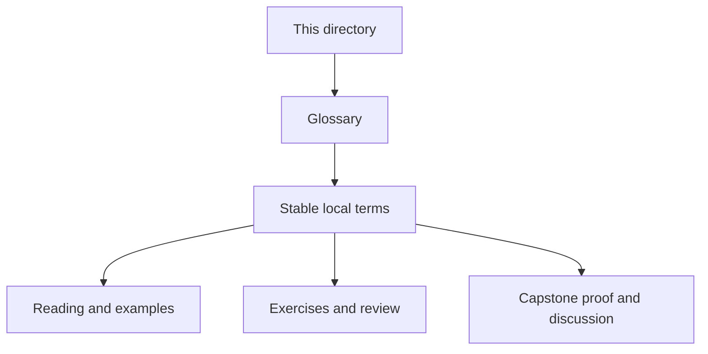
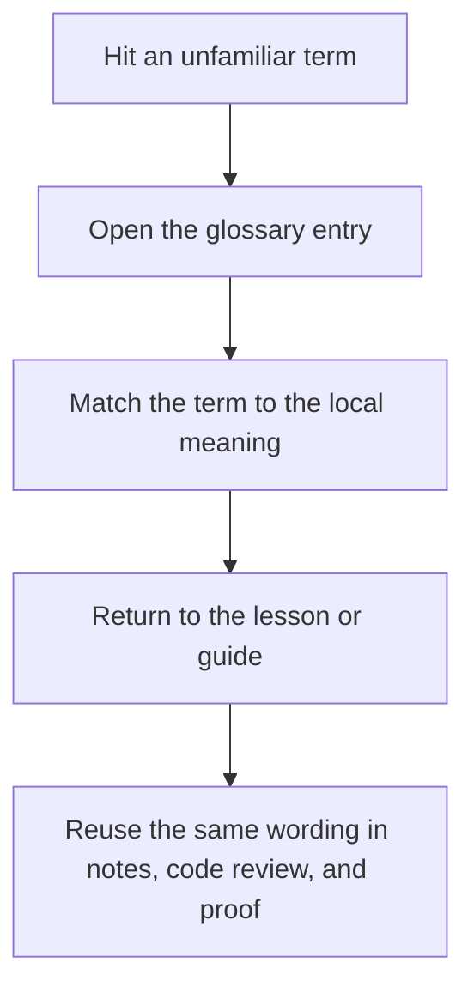

# Module Glossary

<!-- page-maps:start -->
## Glossary Fit

<!-- page-maps:end -->

This glossary belongs to **Module 04: Aggregates, Events, and Collaboration Boundaries** in **Python Object-Oriented Programming**. It keeps the language of this directory stable so the same ideas keep the same names across reading, practice, review, and capstone proof.

## How to use this glossary

Read the directory index first, then return here whenever a page, command, or review discussion starts to feel more vague than the course intends. The goal is stable language, not extra theory.

## Terms in this directory

| Term | Meaning in this directory |
| --- | --- |
| Adapter and Bridge: Wrapping External Systems and Storage | the module's treatment of adapter and bridge: wrapping external systems and storage, used to make the module's main design claim concrete in design work, refactoring, and capstone evidence. |
| Aggregate Lifecycle and Failure Semantics | the module's treatment of aggregate lifecycle and failure semantics, used to make the module's main design claim concrete in design work, refactoring, and capstone evidence. |
| Aggregates and Consistency Boundaries in a Python Service | the module's treatment of aggregates and consistency boundaries in a python service, used to make the module's main design claim concrete in design work, refactoring, and capstone evidence. |
| Cross-Object Invariants and Aggregate-Level Validation | the module's treatment of cross-object invariants and aggregate-level validation, used to make the module's main design claim concrete in design work, refactoring, and capstone evidence. |
| Designing Collaboration Surfaces: How Objects Talk Without Tangle | the module's treatment of designing collaboration surfaces: how objects talk without tangle, used to make the module's main design claim concrete in design work, refactoring, and capstone evidence. |
| Domain Events for Decoupling (Without Full Event Sourcing) | the module's treatment of domain events for decoupling (without full event sourcing), used to make the module's main design claim concrete in design work, refactoring, and capstone evidence. |
| In-Process Event Dispatch: Tiny Observer and Event Bus | the module's treatment of in-process event dispatch: tiny observer and event bus, used to make the module's main design claim concrete in design work, refactoring, and capstone evidence. |
| Projections, Read Models, and Object-Graph Debug Views | the module's treatment of projections, read models, and object-graph debug views, used to make the module's main design claim concrete in design work, refactoring, and capstone evidence. |
| Refactor 3: Monolithic Logic → Aggregates + Events + Strategies + Debuggable Graph | the module's treatment of refactor 3: monolithic logic → aggregates + events + strategies + debuggable graph, used to make the module's main design claim concrete in design work, refactoring, and capstone evidence. |
| Strategy and Policy Objects for Rule Evaluation and Decisions | the module's treatment of strategy and policy objects for rule evaluation and decisions, used to make the module's main design claim concrete in design work, refactoring, and capstone evidence. |
