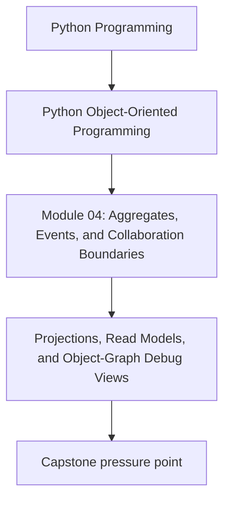
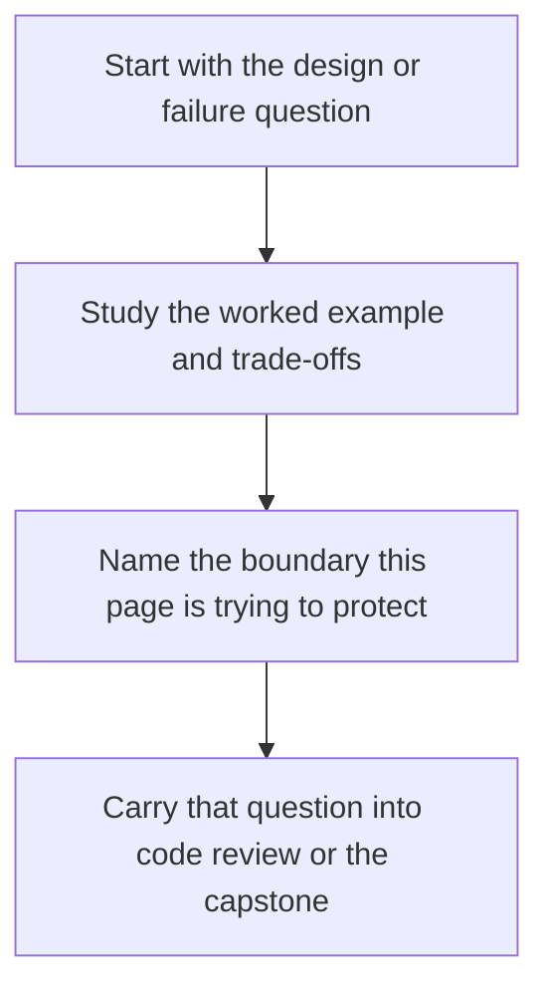

# Projections, Read Models, and Object-Graph Debug Views


<!-- page-maps:start -->
## Concept Position




<!-- page-maps:end -->

Read the first diagram as a placement map: this page is one concept inside its parent module, not a detached essay, and the capstone is the pressure test for whether the idea holds. Read the second diagram as the working rhythm for the page: name the problem, study the example, identify the boundary, then carry one review question forward.

## Purpose

Separate “how we *write* domain state” from “how we *read* and inspect it”.

This core teaches projections/read models:
- derived representations optimized for queries or debugging,
- updated from domain events or from aggregate snapshots.

## Where This Fits

Running example: a monitoring service that fetches metrics, evaluates rules, and emits alerts. In earlier modules we refactored toward a layered design (domain/application/infrastructure) with explicit roles. From M03 onward, we tighten *data integrity* and *lifecycle semantics* so the system stays correct under change.

## 1. Why Projections Exist

Your domain model is optimized for correctness and invariants.

But queries often want:
- “show all active rules by metric”
- “show rule history”
- “show why an alert fired (trace)”

If you contort aggregates to answer every query, they bloat and lose clarity.

Projections solve this by building a derived view for reading.

## 2. Event-Driven Projection Updates

With domain events (M04C34), projection updates become natural:

- `RuleActivated` updates an index of active rules.
- `RuleRetired` moves it to history.

Handlers subscribe to events and update the read model.

Key property:
- projections can be rebuilt from source-of-truth state if corrupted (if you have snapshots or event log).

## 3. Debug Views: Make Object Graphs Inspectable

A **debug view** is a structured representation of an object graph designed for humans.

Example: return a dict that includes:
- policy id,
- active rules by metric,
- counts,
- last evaluation time.

Do not overload `__repr__` to do heavy debug work. Provide explicit debug methods:

```python
def debug_view(self) -> dict:
    return {
        "policy_id": self.policy_id,
        "active_rule_count": len(self.active_rules),
        "active_rules": [r.rule_id for r in self.active_rules],
    }
```

This keeps costs explicit and improves design clarity.

## 4. Correctness Rule: Projections Must Not Drive Domain State

A projection is derived; it is not authoritative.

- domain state → projection
- not projection → domain state

If you let projections mutate domain state, you invert the dependency direction and risk inconsistency.

## Practical Guidelines

- Keep write models (aggregates) focused on invariants and behavior; build separate read models for queries.
- Update projections from domain events or snapshots; ensure rebuild is possible.
- Use explicit debug-view methods instead of heavy `__repr__` or hidden properties.
- Never treat projections as the source of truth.

## Exercises for Mastery

1. Build a projection mapping metric → list of active rule IDs. Update it on `RuleActivated` and `RuleRetired`.
2. Add a `debug_view()` to your aggregate and use it in one integration test assertion.
3. Demonstrate how a corrupted projection can be rebuilt from the aggregate state (or from events, if you have them).
