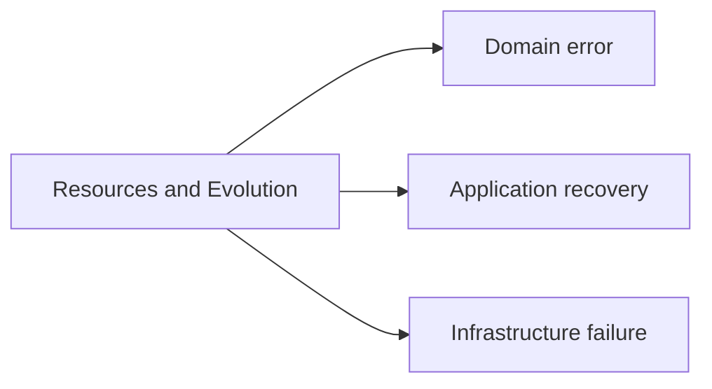
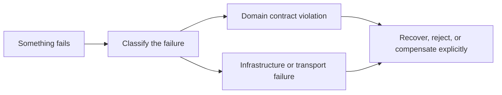

# Domain Errors, Recovery Contracts, and Compensating Actions

<!-- page-maps:start -->
## Page Maps

<!-- page-maps:end -->

## Purpose

An object-oriented system becomes clumsy when every failure is treated as a generic
exception and every retry is treated as harmless. This page gives the missing design
language for domain errors, recovery contracts, and compensating actions.

## Why this topic matters

If a course covers resources and evolution but does not cover error modeling well, it
leaves learners with one of the most common real-world blind spots:

- domain failures and infrastructure failures get mixed together
- callers cannot tell which errors are part of the public contract
- retries repeat unsafe side effects
- partial work has no named compensation policy

That is not operational polish. It is part of the object contract.

## Distinguish failure types first

### Domain error

The request violates a business rule or lifecycle rule:

- a rule cannot be retired from a locked policy
- a threshold is outside the allowed range
- a state transition is illegal

These are part of the domain contract and should be modeled clearly.

### Application or workflow failure

The request was legitimate, but one step of a larger operation needs recovery logic:

- one write succeeded and a later one failed
- an event should not be published until state is durable
- a timeout requires retry, delay, or human review

These belong in the application or orchestration layer, not inside random entities.

### Infrastructure failure

The storage, network, or runtime boundary failed. That may still affect the public API,
but it should not be confused with a domain rule.

## Recovery contract

A recovery contract answers:

- what failed
- what state is still authoritative
- what the caller can retry safely
- what compensation is required before the system is coherent again

Without that contract, exception handling becomes guesswork.

## Compensating action is not rollback theater

Rollback is not always possible. Some actions have already escaped:

- a message was sent
- an audit record was written
- an external system was called

In those cases, you need a compensating action or explicit follow-up step. The key idea
is to name it and place ownership clearly, not to pretend the system is magically atomic.

## Design rules

- Model domain errors as domain concepts, not anonymous strings.
- Translate infrastructure exceptions at the boundary where they enter the system.
- Keep compensation policy in orchestration or unit-of-work logic, not scattered through entities.
- Decide which errors are safe to retry and which require human review or explicit repair.

## Review questions

- Can a caller tell the difference between a business-rule failure and a transient dependency failure?
- Does the code say what state remains authoritative after partial failure?
- Are retries attached to idempotent operations or explicit compensation design?
- Is the public error surface small and meaningful, or just a leak of internals?

## Practical guidelines

- Use a small, named error taxonomy at the domain boundary.
- Convert raw dependency exceptions into boundary-specific failures.
- Write compensation rules down when side effects can escape before full success.
- Test unhappy paths as design behavior, not as incidental logging branches.

## Exercises for mastery

1. Split one generic exception path into domain, orchestration, and infrastructure failure cases.
2. Add a named compensation rule for one multi-step operation with an external side effect.
3. Review one retry policy and document why it is or is not safe.
