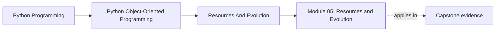
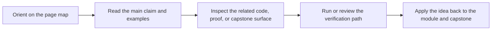

# Module 05: Resources and Evolution

<!-- page-maps:start -->
## Page Maps

<!-- page-maps:end -->

Correct object models still fail if they leak resources, blur failure handling, or
cannot evolve safely. This module treats survivability as part of design quality.

Keep one question in view while reading:

> Who owns the cost when this behavior fails, retries, leaks, or needs to evolve under an existing contract?

That question keeps operational concerns attached to ownership instead of dissolving into
general “infrastructure” language.

## Preflight

- You should already be able to name the ownership boundary for domain behavior before attaching operational concerns to it.
- If retries, cleanup, or public API boundaries still feel like "someone else’s layer," treat this module as design work, not operations trivia.
- Keep asking who pays for failure, leakage, or compatibility drift when a change goes wrong.

## Learning outcomes

- assign cleanup, failure handling, retries, and compatibility pressure to explicit owners
- distinguish domain errors from system-boundary failures without flattening them into generic exceptions
- evaluate idempotency, unit-of-work boundaries, and public surface discipline as long-term design contracts
- extend behavior without bypassing invariants or widening the accidental public API

## Why this module matters

A design can look elegant in greenfield code review and still fail in production because
it leaks cleanup responsibilities, retries unsafely, widens public surfaces casually, or
cannot absorb a new requirement without violating old assumptions.

This module treats operational survivability as part of object-oriented design rather
than as a later concern owned by "infrastructure people."

## Main questions

- Who owns files, sockets, connections, and cleanup obligations?
- How do you group changes and failure boundaries coherently?
- Which failures belong in the domain contract, and which belong at the system boundary?
- What makes retries safe or unsafe?
- Which modules are public contracts and which are implementation detail?
- How do you add new behavior without quietly breaking old callers?

## Reading path

1. Start with resource ownership and unit-of-work boundaries.
2. Read cleanup, domain errors, retries, and error propagation as one operational cluster.
3. Then move to public API boundaries, smells, copying, and compatibility.
4. Finish with the refactor chapter to test whether the design can evolve without collapse.

## Common failure modes

- making callers responsible for cleanup details they cannot reliably remember
- flattening all failures into generic exceptions with no recovery contract
- retrying operations that are not idempotent and duplicating side effects
- logging everywhere without deciding what contract the logs actually support
- exposing internal modules as accidental public API
- adding new features by bypassing existing invariants instead of extending them cleanly

## Exercises

- Pick one operation and explain who owns cleanup, who owns retry policy, and which failures should remain visible to callers.
- Review one public surface and state which modules are contract and which modules should remain implementation detail.
- Describe one feature addition that should extend the existing model and one that would be a bypass around current invariants.

## Capstone connection

The capstone's in-memory unit of work, runtime facade, and repository boundary are
small on purpose, but they model the pressure this module is about: who owns failure,
who commits change, which surfaces are public, and how new rule behavior can be added
without rewriting the rest of the system.

## Closing criteria

You should finish this module able to shape object-oriented Python systems that stay
operable and maintainable under long-term change rather than only under greenfield conditions.
