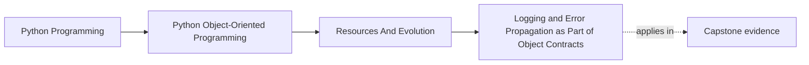
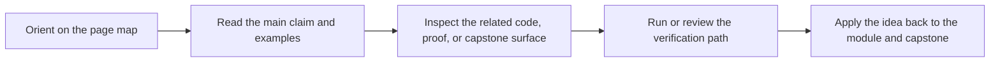

# Logging and Error Propagation as Part of Object Contracts


<!-- page-maps:start -->
## Page Maps




<!-- page-maps:end -->

## Purpose

Treat errors and logs as part of your system’s **observable behavior**.

You will learn:
- how to define an error taxonomy (domain vs infrastructure),
- how to propagate errors without losing context,
- and how to log without turning logs into noise.

## Where This Fits

Running example: a monitoring service that fetches metrics, evaluates rules, and emits alerts. In earlier modules we refactored toward a layered design (domain/application/infrastructure) with explicit roles. From M03 onward, we tighten *data integrity* and *lifecycle semantics* so the system stays correct under change.

## 1. Errors Are Part of the API

A method signature implies:
- what it returns on success,
- and what failures can occur.

Even in Python (without checked exceptions), you can still design a stable failure contract by:
- using specific exception types,
- documenting when they happen,
- and translating external errors at boundaries (M04C38).

## 2. Error Taxonomy (Practical)

Two primary buckets:

- **Domain errors**: invariant violation, illegal transition, not found.
  - deterministic, testable
- **Infrastructure errors**: network failure, storage down, timeout.
  - environmental

Keep them distinct. It helps both design and teaching.

## 3. Logging: Context, Not Chatter

Good logs answer:
- what happened,
- to which entity (ids),
- in which operation,
- with which outcome.

Bad logs:
- repeat the same message on every loop,
- log exceptions without context,
- log at the wrong layer (domain objects logging I/O failures).

Rule: domain should not log. Application/infrastructure logs with context around domain operations.

## 4. Propagate Errors with Context

When catching an error, either:
- handle it fully, or
- re-raise with context.

In Python, prefer exception chaining:

```python
try:
    ...
except TimeoutError as e:
    raise MetricFetchUnavailable("metric backend timeout") from e
```

This preserves the original traceback while giving your domain/application a stable error type.

## 5. Tests for Error Behavior

Write tests that assert:
- domain errors are raised for invariant violations,
- infrastructure errors are translated to your stable error types,
- logging occurs at boundaries (if you test logging).

You are testing *behavioral contracts*, not “did we print something”.

## Practical Guidelines

- Define and use domain-specific exception types for domain failures and translated infrastructure failures.
- Do not log inside pure domain objects; log at boundaries with context (ids, operation names).
- Use exception chaining (`raise ... from e`) when translating errors.
- Treat error behavior as part of the API; test it.

## Exercises for Mastery

1. Define `RuleNotFound` and `MetricFetchUnavailable` exceptions. Refactor call sites to use them.
2. Add structured context to a log line (policy_id, rule_id) in the orchestrator boundary.
3. Write a test that asserts error translation keeps the original exception chained.
