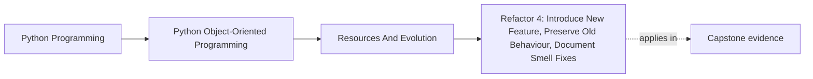

# Refactor 4: Introduce New Feature, Preserve Old Behaviour, Document Smell Fixes

<!-- page-maps:start -->
## Page Maps

<!-- page-maps:end -->

## Goal

Capstone refactor: add a non-trivial feature to the monitoring system **without breaking** existing behavior or stored data.

Example feature options:
- a new rule kind (e.g., rate-of-change),
- a new alert dimension (severity),
- a new suppression policy (dedupe window),
- or a new metric source.

The key constraints:
- preserve compatibility (M05C49),
- keep domain integrity (Modules 3–4),
- keep resources and failures disciplined (Module 5).

## Where This Fits

Running example: a monitoring service that fetches metrics, evaluates rules, and emits alerts. In earlier modules we refactored toward a layered design (domain/application/infrastructure) with explicit roles. From M03 onward, we tighten *data integrity* and *lifecycle semantics* so the system stays correct under change.

## 1. Choose the Feature and Name the Contracts

Before coding, write down:

- what public API must remain stable,
- what serialized formats must remain readable,
- what behaviors must not change (golden tests),
- what new behavior is being added.

This is your learning contract for the refactor.

## 2. Plan the Change as Thin Slices

A safe plan:

1. Add new domain types/strategies *alongside* old behavior.
2. Add tests for the new feature.
3. Wire the feature behind a flag or a new strategy registration.
4. Preserve old strategy behavior and tests.
5. If data formats change, add schema version + migration (M05C49).
6. Update public facade exports if needed (M05C46).
7. Remove dead code only after tests prove equivalence for existing paths.

## 3. Concrete Deliverables (What Your PR Should Contain)

Minimum deliverables:

- **Domain**: new strategy/policy object (M04C37) + invariants.
- **Application wiring**: register the new strategy (composition root).
- **DTO updates**: boundary validation for new config fields (M03C26).
- **Compatibility**: schema versioning/migration if storage changes (M05C49).
- **Resources**: ensure any new adapters are context-managed (M05C41).
- **Tests**:
  - golden tests for old behavior,
  - unit tests for new strategy,
  - integration test for new feature path,
  - migration tests if applicable.

## 4. Document the Smell Fixes

In your PR or module notes, explicitly state:

- smell(s) removed (M05C47),
- refactor moves used,
- and why the new design is safer.

Example:
- “Removed `if/elif` ladder by introducing `RuleStrategy`.”
- “Eliminated `Optional activated_at` by typestate split.”
- “Protected public imports with facade to enable safe refactors.”

## 5. Pedagogical Closure: What You Now Know

At this point, you can:

- design objects with explicit identity/equality semantics (Module 1),
- structure code with clean boundaries and ports/adapters (Module 2),
- build domain models with invariants, typestate, and boundary validation (Module 3),
- enforce cross-object invariants with aggregates and decouple with events/strategies (Module 4),
- manage resources, failure semantics, retries, and evolution safely (Module 5).

A course-book should end with capability, not just content. This is the capability.

## Practical Guidelines

- Write the compatibility contract first; then code.
- Add new behavior without breaking old behavior: tests first, thin slices, delete later.
- Use strategies for new variation points; keep orchestrators stable.
- If persistence formats change, version and migrate with tests.
- Close the loop: document smells fixed and the refactor moves used.

## Exercises for Mastery

1. Implement a new rule strategy (e.g., rate-of-change). Add unit tests and integrate it without modifying the evaluation loop.
2. Add a new config field for the feature, validate it at the boundary, and translate into domain types.
3. If you change persisted data, write a migration and tests, then prove old data still loads and behaves as before.
