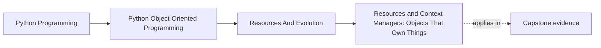
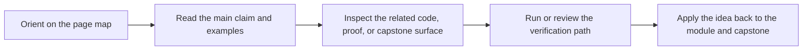

# Resources and Context Managers: Objects That Own Things


<!-- page-maps:start -->
## Page Maps




<!-- page-maps:end -->

## Purpose

Make resource ownership explicit and safe.

In Python services, resources include:
- files, sockets, DB connections,
- locks,
- temporary directories,
- and any object that must be cleaned up.

Context managers (`with`) are your primary correctness tool for resource lifetime.

## 1. Ownership: Someone Must Be Responsible

A resource without a clear owner leaks.

Good design explicitly assigns ownership:
- “this object opens the file and must close it”
- “this adapter owns the socket”

Without ownership, cleanup becomes “best effort” and bugs become intermittent.

## 2. Context Managers: Deterministic Setup/Cleanup

A context manager defines:

- `__enter__`: acquire/setup
- `__exit__`: cleanup, even if an exception occurs

```python
with open("data.txt") as f:
    data = f.read()
# file closed here, even on exceptions
```

This is not syntactic sugar — it is a *correctness primitive*.

## 3. Designing Your Own Resource Owners (Simple Case)

If your adapter opens/closes a resource, make it a context manager:

```python
class Connection:
    def __enter__(self):
        self._conn = ...
        return self

    def __exit__(self, exc_type, exc, tb):
        self._conn.close()
        return False  # don't swallow exceptions
```

Rule: do not swallow exceptions by default. Propagate errors unless you have a strong policy reason (M05C45).

## 4. Composition: Nested Resources

Often you compose resources:

```python
with MetricClient(...) as client, RuleStore(...) as store:
    ...
```

This builds a *structured lifetime*: open everything, run work, close everything deterministically.

## 5. `contextlib` Helpers

`contextlib` provides tools to reduce boilerplate:
- `contextmanager` decorator,
- `ExitStack` for dynamic resource sets.

Use them when they improve clarity, not to be clever.

## Practical Guidelines

- Make resource ownership explicit in your design; every resource should have a clear owner.
- Use context managers for deterministic cleanup, especially around I/O.
- Do not rely on `__del__` for cleanup; it is not deterministic (see M05C43).
- Do not swallow exceptions in `__exit__` unless policy requires it; propagate by default.

## Exercises for Mastery

1. Wrap a resource-owning adapter in a context manager and write a test proving cleanup happens on exceptions.
2. Use `ExitStack` to manage a variable number of resources and confirm all are closed.
3. Find one place in your code where a file/socket/connection is opened without a `with`. Refactor it.
