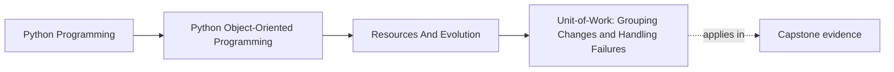
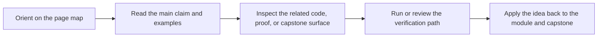

# Unit-of-Work: Grouping Changes and Handling Failures


<!-- page-maps:start -->
## Page Maps




<!-- page-maps:end -->

## Purpose

Coordinate multiple writes as one logical “commit”.

A **Unit of Work (UoW)**:
- collects changes (often through repositories),
- commits them together,
- rolls back on failure.

Even without a database transaction, UoW gives you a clean failure model and a teaching-friendly structure.

## Where This Fits

Running example: a monitoring service that fetches metrics, evaluates rules, and emits alerts. In earlier modules we refactored toward a layered design (domain/application/infrastructure) with explicit roles. From M03 onward, we tighten *data integrity* and *lifecycle semantics* so the system stays correct under change.

## 1. Why You Need Unit-of-Work

If an operation does:
- save aggregate state,
- write events to outbox,
- update projection,

…you must decide what happens when step 2 fails.

Without UoW you get partial commits and inconsistency.

UoW gives you a central place to define:
- commit boundaries,
- rollback behavior,
- and resource lifetime (via context manager).

## 2. A Minimal UoW Shape

Common interface:

- `__enter__` opens resources (db connection, session)
- `.commit()` persists changes
- `.rollback()` discards changes
- `__exit__` ensures rollback on exceptions

Sketch:

```python
class UnitOfWork:
    def __enter__(self): ...
    def __exit__(self, exc_type, exc, tb):
        if exc_type: self.rollback()
        self.close()
    def commit(self): ...
    def rollback(self): ...
```

## 3. Repositories Live Inside the UoW

The UoW typically exposes repositories:

```python
with uow:
    policy = uow.policies.get(policy_id)
    policy.retire_rule(...)
    uow.commit()
```

This makes it hard to use repositories outside a commit boundary, which is good for correctness.

## 4. Integrating Domain Events via Outbox

If your aggregate emits events, the UoW can store them in an outbox alongside saving state.

Commit then means:
- persist state,
- persist outbox,
- and only then publish events.

This prevents “published but not saved” or “saved but not published” inconsistencies (within the limits of your persistence).

## 5. Tests: UoW Policy Matters

Write tests showing:
- exceptions trigger rollback,
- commit persists changes,
- events are only published after commit.

These tests are where you teach failure semantics clearly.

## Practical Guidelines

- Use a UoW for operations that must update multiple pieces of state consistently.
- Make the UoW a context manager; rollback on exceptions by default.
- Expose repositories through the UoW to enforce commit boundaries.
- Treat domain event publication as part of the commit pipeline (often via outbox).

## Exercises for Mastery

1. Implement a fake in-memory UoW and write tests for commit/rollback behavior.
2. Integrate event outbox storage into the UoW and prove events publish only after commit.
3. Refactor one multi-step operation to use a UoW instead of ad-hoc writes.
