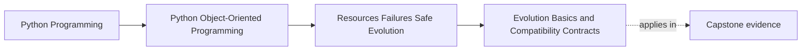
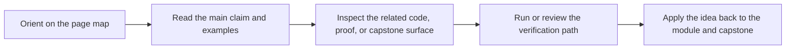

# Evolution Basics and Compatibility Contracts

<!-- page-maps:start -->
## Page Maps

<!-- page-maps:end -->

Read the first diagram as a placement map: this page is one concept inside its parent module, not a detached essay, and the capstone is the pressure test for whether the idea holds. Read the second diagram as the working rhythm for the page: name the problem, study the example, identify the boundary, then carry one review question forward.

## Purpose

Make changes without breaking users, stored data, or callers.

Evolution is not “we changed the code”; it is “we changed the contract”.
This core teaches compatibility thinking for:
- public Python APIs,
- serialized data formats,
- and domain behavior.

## 1. Identify What Must Stay Compatible

Compatibility targets:

- **public API** (what callers import/use) — protected by facades (M05C46)
- **serialized data** (stored rules/policies) — must be readable over time
- **observable behavior** (alerts emitted, logs, error types)

If you don’t name the contracts, you can’t preserve them.

## 2. Backward vs Forward Compatibility

- Backward compatible: new code can read old data / old callers still work.
- Forward compatible: old code can tolerate new data (harder).

A practical approach:
- **tolerant reader**: accept extra fields, defaults for missing
- **strict writer**: write the newest correct format

This keeps systems upgradeable without chaos.

## 3. Schema Versioning and Migrations

For stored data:
- include a `schema_version`,
- write migration functions `v1 -> v2`,
- test migrations.

Keep migrations explicit and deterministic.

Do not hide migrations inside random constructors — they become untestable and surprising.

## 4. Behavioral Compatibility and Tests

Behavior changes are the most dangerous.

Use:
- golden tests (expected outputs for known inputs),
- integration tests around orchestrator cycles,
- property tests for invariants.

When adding features, preserve old behavior unless you intentionally version-break it (M05C50).

## Practical Guidelines

- Name your compatibility contracts: public API, serialized formats, observable behavior.
- Use a tolerant reader + strict writer strategy for data evolution.
- Include schema version markers and write explicit migrations with tests.
- Protect your public surface with facades; avoid deep imports by callers.

## Exercises for Mastery

1. Add a `schema_version` to a stored representation and write a migration for a small change (rename a field).
2. Write a golden test for one important behavior and keep it passing while refactoring.
3. Identify one accidental public API surface (deep import). Hide it behind a facade and document the contract.
