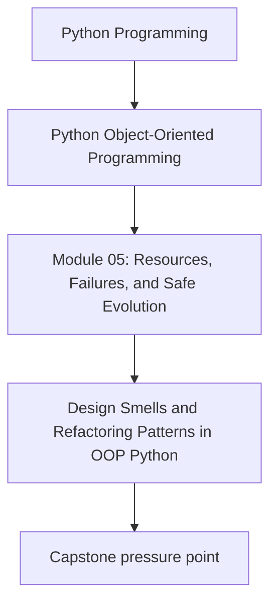
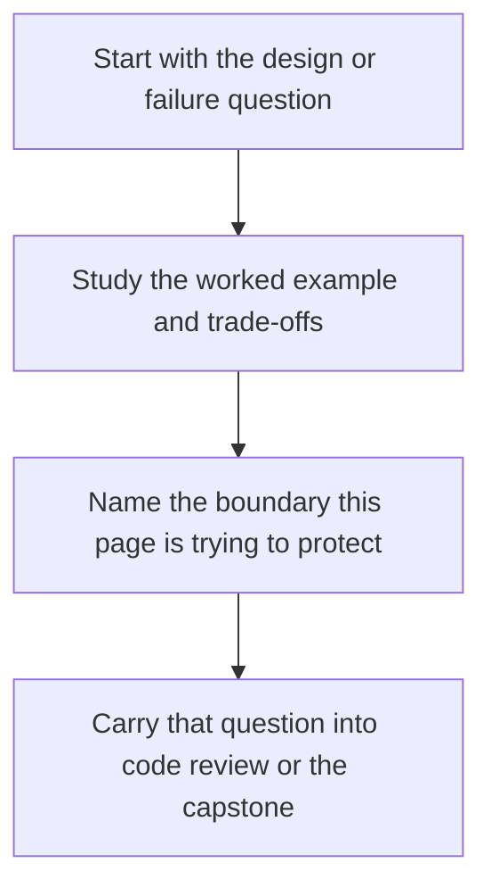

# Design Smells and Refactoring Patterns in OOP Python

<!-- page-maps:start -->
## Concept Position

<!-- page-maps:end -->

Read the first diagram as a placement map: this page is one concept inside its parent module, not a detached essay, and the capstone is the pressure test for whether the idea holds. Read the second diagram as the working rhythm for the page: name the problem, study the example, identify the boundary, then carry one review question forward.

## Purpose

Build a shared vocabulary for recognizing and fixing design problems.

This core catalogs common smells and pairs them with refactoring moves that we have already developed across Modules 1–5.

## 1. Smells: What to Look For

Common OOP Python smells:

- **God object**: one class knows/does everything.
- **Feature envy**: one method manipulates another object’s data heavily.
- **Anemic domain**: domain objects are data bags; logic lives in services.
- **Primitive obsession**: raw `str/int/float` carry domain meaning (M02C14).
- **Boolean flags / state soup**: many flags represent lifecycle (M03C28).
- **Tangled dependencies**: circular imports, infrastructure inside domain (M04C39).
- **Hidden side effects**: properties that do I/O (M03C22).
- **Leaky resources**: missing cleanup boundaries (M05C41–M05C43).

## 2. Refactoring Moves (Patterns You Can Apply)

High-leverage moves:

- Introduce semantic types (Module 2).
- Introduce aggregate roots for invariants (M04C31–M04C32).
- Introduce typestate to eliminate illegal states (M03C28–M03C29).
- Extract strategies for variation points (M04C37).
- Introduce ports/adapters (Module 2 + M04C38).
- Introduce UoW for commit boundaries (M05C42).
- Introduce facades to protect public API (M05C46).

## 3. How to Refactor Safely

Correct refactoring rules:

1. **Preserve behavior**: tests must stay green.
2. **Work in thin slices**: introduce new shape alongside old, migrate, delete old.
3. **Move one responsibility at a time**.
4. **Add tests at the seam** when you can’t test internals directly.

This course’s refactor cores (M02C20, M03C30, M04C40, M05C50) model this workflow.

## 4. Teaching Lens: Smell → Failure Mode → Refactor

For education, always connect:

- smell: “optional fields everywhere”
- failure mode: “invalid active rules slip into evaluation”
- refactor: “typestate + domain invariants”

This helps you see design as cause-and-effect, not taste.

## Practical Guidelines

- Use smells as diagnostic tools, not as insults.
- Always connect a smell to a concrete failure mode and a concrete refactor.
- Refactor under tests; add tests at boundaries if needed.
- Prefer small, composable objects over clever inheritance and flag soup.

## Exercises for Mastery

1. Pick one smell in your codebase. Write the failure mode it can cause. Apply one refactor move and show the diff.
2. Identify one variation point implemented with conditionals. Replace with a strategy.
3. Create a “smell checklist” for code reviews in your project (5 items max).
