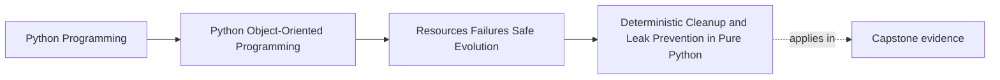
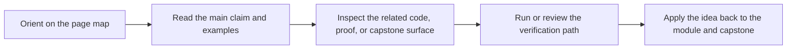

# Deterministic Cleanup and Leak Prevention in Pure Python

<!-- page-maps:start -->
## Page Maps

<!-- page-maps:end -->

Read the first diagram as a placement map: this page is one concept inside its parent module, not a detached essay, and the capstone is the pressure test for whether the idea holds. Read the second diagram as the working rhythm for the page: name the problem, study the example, identify the boundary, then carry one review question forward.

## Purpose

Prevent resource leaks and “sometimes it works” bugs by understanding Python’s cleanup mechanics.

Key idea:
- **context managers** are deterministic,
- garbage collection and `__del__` are not reliable cleanup strategies.

## 1. Why `__del__` Is Not a Cleanup Contract

Finalizers run:
- at an implementation-dependent time,
- possibly never (cycles, interpreter shutdown),
- and with limited guarantees about what globals still exist.

Therefore:
> `__del__` is not a correctness primitive.

Use it only as a last resort, and never for critical cleanup like releasing locks or closing files.

## 2. Prefer `with` and Explicit Close

Two reliable patterns:

- `with` for structured lifetime,
- explicit `.close()` for unstructured cases (but still deterministic if called).

If you expose `.close()`, document that it is idempotent (safe to call twice).

## 3. `weakref.finalize` as a Safety Net (Not a Primary Tool)

`weakref.finalize` can register a callback when an object is about to be GC’d.

This can be useful as a *warning mechanism* (log a leak), but it is still not a deterministic guarantee.

Think of it as “airbag”, not “brakes”.

## 4. Leak Prevention by Design

Design patterns that reduce leaks:
- resource ownership is explicit (M05C41),
- UoW scopes resource usage (M05C42),
- adapters are context managers,
- avoid global singletons that hold resources forever.

Leaks are often *architecture*, not “forgot to close”.

## 5. Testing for Leaks (Pragmatic)

In unit tests, you can often assert:
- `.close()` was called on a fake resource,
- `__exit__` ran on exception paths.

Avoid relying on GC timing in tests.

Teaching rule: test cleanup by instrumenting resources, not by hoping GC runs.

## Practical Guidelines

- Do not rely on `__del__` for required cleanup; use context managers and explicit close.
- Make `.close()` idempotent if you expose it.
- Use `weakref.finalize` only as a safety net (e.g., log unclosed resources).
- Prevent leaks by clear ownership and scoped lifetimes (context managers + UoW).

## Exercises for Mastery

1. Implement a fake resource that records whether `.close()` was called. Use it to test cleanup on success and on exception.
2. Add a `weakref.finalize` warning for a resource owner and demonstrate it triggers when you forget to close (manual experiment).
3. Find a global or long-lived object in your code that owns a resource. Refactor it to use scoped lifetime.
