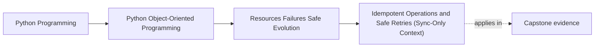

# Idempotent Operations and Safe Retries (Sync-Only Context)

<!-- page-maps:start -->
## Page Maps

<!-- page-maps:end -->

Read the first diagram as a placement map: this page is one concept inside its parent module, not a detached essay, and the capstone is the pressure test for whether the idea holds. Read the second diagram as the working rhythm for the page: name the problem, study the example, identify the boundary, then carry one review question forward.

## Purpose

Design operations that can be retried safely after failures.

Real systems fail:
- network timeouts,
- transient storage errors,
- process restarts.

If a caller retries, you want “do it once” behavior, not “duplicate everything” behavior.

## Where This Fits

Running example: a monitoring service that fetches metrics, evaluates rules, and emits alerts. In earlier modules we refactored toward a layered design (domain/application/infrastructure) with explicit roles. From M03 onward, we tighten *data integrity* and *lifecycle semantics* so the system stays correct under change.

## 1. What Idempotent Means

An operation is **idempotent** if repeating it has the same effect as doing it once.

Examples:
- “set threshold to 5” can be idempotent.
- “increment counter” is not idempotent unless you track deduplication keys.

Important nuance:
- idempotency is about *effects*, not return values.

## 2. Where Retries Happen

Retries occur:
- in HTTP clients,
- in message consumers,
- in job runners,
- in your own code when catching transient errors.

Therefore, your *write operations* should be designed for retry safety where possible.

## 3. Idempotency Keys and Deduplication

Common pattern:
- operation carries an `idempotency_key` (a UUID),
- storage records which keys have been applied,
- repeated request returns the same result without reapplying side effects.

In our domain: emitting an alert could use an idempotency key based on `(rule_id, evaluation_timestamp)` to avoid duplicate alerts under retry.

## 4. Make Domain Operations Deterministic and Side-Effect-Free

A strong design rule:
- domain operations compute new state and events,
- side effects (I/O, publish) happen after commit via UoW.

This separation makes retries much simpler:
- retry the commit step,
- don’t rerun nondeterministic domain logic unless needed.

## 5. Testing Retry Safety

Write tests for:
- applying the same command twice does not duplicate effects,
- outbox publishing uses deduplication and/or “publish after commit” semantics.

Even in pure Python, you can simulate retries by calling the same function twice and asserting stable results.

## Practical Guidelines

- Design write operations to be idempotent when retries are plausible.
- Use idempotency keys for operations with external side effects (alerts, messages, emails).
- Separate domain computation from side effects via events + UoW/outbox.
- Test retry behavior explicitly; don’t assume it.

## Exercises for Mastery

1. Add an idempotency key to an alert emission operation and store applied keys in a fake repository. Test double-apply.
2. Refactor an “increment” style operation into a “set” style operation where possible.
3. Simulate a transient failure during publish and retry. Confirm no duplicate alerts are emitted.
