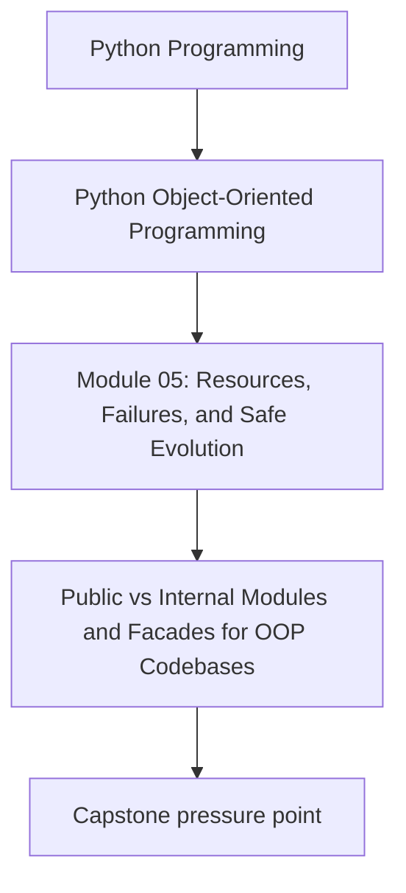
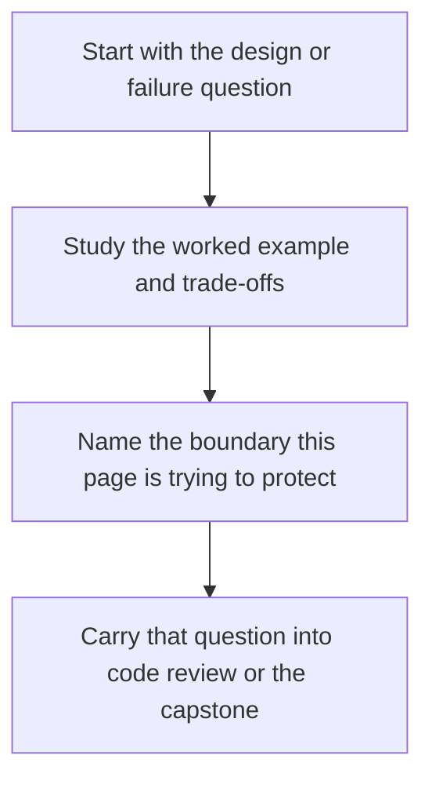

# Public vs Internal Modules and Facades for OOP Codebases


<!-- page-maps:start -->
## Concept Position




<!-- page-maps:end -->

Read the first diagram as a placement map: this page is one concept inside its parent module, not a detached essay, and the capstone is the pressure test for whether the idea holds. Read the second diagram as the working rhythm for the page: name the problem, study the example, identify the boundary, then carry one review question forward.

## Purpose

Make your codebase evolvable by defining what is **public API** vs **internal implementation**.

This is not about aesthetics; it is about preserving correctness under change:
- internal refactors should not break callers,
- public surfaces should be stable and documented.

## 1. Public API Is a Contract

In a Python package, “public” often means:
- what you import and use from outside the package.

If internal modules are imported directly by many callers, you lose the ability to refactor safely.

Goal:
- expose a small public surface,
- keep internals behind it.

## 2. Facade Modules: One Door Into the Package

A facade module re-exports the intended public objects:

- `monitoring/__init__.py` or `monitoring/api.py`

Example:
```python
from .application.services import MonitoringService
from .domain.types import MetricName, Threshold
```

Callers import from the facade, not from deep internals.

This reduces coupling and improves clarity because you can see “the surface”, not the whole engine.

## 3. Naming Conventions and Structure

Common conventions:
- leading underscore for internal modules/classes (`_internal.py`),
- avoid exporting internals in `__all__`,
- keep domain/application/infrastructure separate (Module 2).

Conventions are not enforcement, but they are strong signals in code review.

## 4. Testing the Facade Contract

A useful practice:
- write tests that import only from the public facade for “consumer style” tests.

This catches accidental dependency on internal modules and makes refactoring safer.

## Practical Guidelines

- Define a small public facade for your package; discourage deep imports by callers.
- Use module structure to reflect architecture: domain/application/infrastructure.
- Mark internals clearly (underscores, not exported).
- Write at least one consumer-style test that uses only the public facade.

## Exercises for Mastery

1. Create a facade module and refactor one client import to use it.
2. Identify an internal module imported widely. Hide it behind the facade and update imports.
3. Add a test that ensures your public surface can be imported without pulling in infrastructure dependencies unexpectedly.
