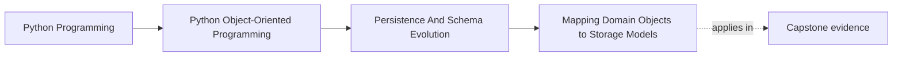
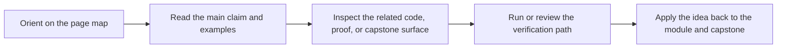

# Mapping Domain Objects to Storage Models


<!-- page-maps:start -->
## Page Maps




<!-- page-maps:end -->

## Purpose

Translate between rich domain objects and storage-friendly records without letting
storage shape dictate the object model.

## 1. Domain and Storage Have Different Jobs

Domain objects exist to preserve meaning and behavior.
Storage models exist to persist and retrieve data efficiently.

Those concerns overlap, but they are not identical. A database row can be denormalized,
nullable, or optimized for indexing without becoming the best in-memory object shape.

## 2. Use Explicit Mappers

A mapper makes translation visible:

```python
def policy_to_record(policy: MonitoringPolicy) -> PolicyRecord: ...
def record_to_policy(record: PolicyRecord) -> MonitoringPolicy: ...
```

That indirection is valuable because it localizes format change and stops the rest of
the system from learning storage trivia.

## 3. Semantic Types Should Survive the Boundary

Do not widen `MetricName`, `Severity`, or `RuleId` into untyped strings throughout
the application just because the database stores strings. Convert at the edge.

Typed domain values are part of the correctness contract, not ornament.

## 4. Prefer Small Translation Functions over Clever Metadata

Heavy reflection or ORM magic often hides where a field changed meaning. In a teaching
codebase and in many production systems, explicit mapper functions are easier to review,
test, and evolve.

## Practical Guidelines

- Keep storage record types separate from domain types.
- Convert raw storage primitives into semantic domain types during rehydration.
- Use explicit mapper code when clarity matters more than framework convenience.
- Treat nullability and denormalization as boundary concerns, not domain defaults.

## Exercises for Mastery

1. Create a mapper that round-trips one aggregate between a domain object and a record type.
2. Replace one leaked storage primitive in your domain with a semantic wrapper type.
3. Review one ORM-backed model and list which fields should stay storage-only.
