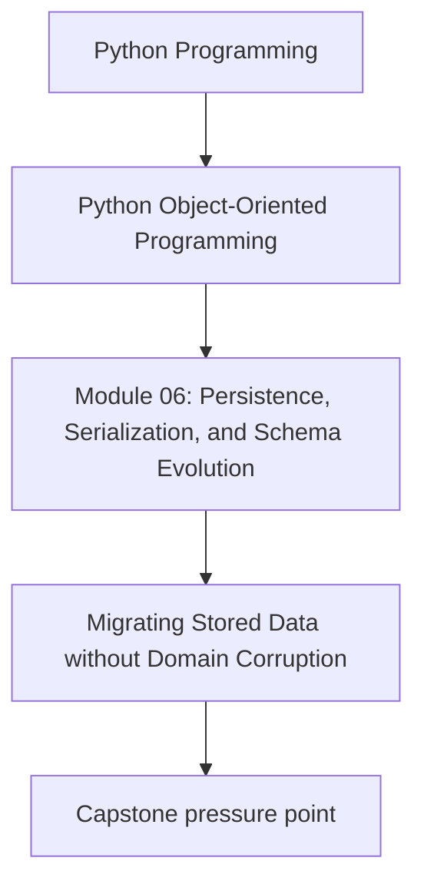
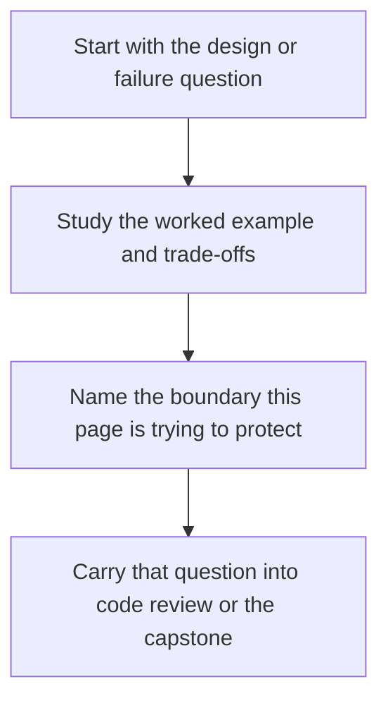

# Migrating Stored Data without Domain Corruption

<!-- page-maps:start -->
## Concept Position

<!-- page-maps:end -->

Read the first diagram as a placement map: this page is one concept inside its parent module, not a detached essay, and the capstone is the pressure test for whether the idea holds. Read the second diagram as the working rhythm for the page: name the problem, study the example, identify the boundary, then carry one review question forward.

## Purpose

Plan data migration so stored artifacts can evolve without normalizing broken history
into the live domain.

## 1. Migration Is a Domain Risk

Bad migration code can do more harm than bad schema code because it rewrites the past.
Treat migration scripts as production code with explicit review and verification.

## 2. Prefer Repeatable, Observable Steps

Strong migration plans answer:

- what transforms
- how it is verified
- whether it can run twice safely
- how to recover if it stops halfway

That is more important than compressing everything into one clever script.

## 3. Keep Repair Logic Separate from Everyday Loading

Do not let normal repositories absorb one-off migration behavior forever. Use explicit
migration tools when possible, and keep runtime loaders focused on supported versions.

## 4. Validate Semantics after Shape Change

A migration that produces syntactically valid data can still violate domain meaning.
Re-run domain construction, contract tests, or sample audits after transformation.

## Practical Guidelines

- Treat migration code as reviewed, tested production code.
- Design migrations to be observable, restartable, and preferably idempotent.
- Keep one-off repair logic out of normal repository paths when practical.
- Verify semantic validity after migration, not only structural validity.

## Exercises for Mastery

1. Write a migration checklist for one stored format in your system.
2. Add a semantic validation step after a shape-changing migration.
3. Identify one migration behavior that should not remain in the normal load path.
