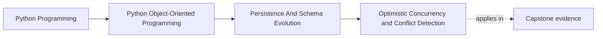
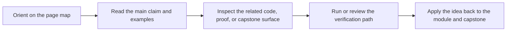

# Optimistic Concurrency and Conflict Detection

<!-- page-maps:start -->
## Page Maps

<!-- page-maps:end -->

## Purpose

Detect stale writes when two actors try to change the same aggregate without forcing
every system into coarse global locking.

## 1. Conflicts Exist Even in “Simple” Systems

A monitoring rule may be edited by two requests, two workers, or one user and one
background job. If both load version 7 and each saves different changes, one write
must lose or merge deliberately.

Ignoring that problem is still a policy. It is just a bad one.

## 2. Version Tokens Make Staleness Visible

Optimistic concurrency usually tracks a version number, timestamp, or opaque token:

- load aggregate with version 7
- save only if current stored version is still 7
- otherwise raise a conflict

That turns silent overwrite into explicit behavior.

## 3. Merge Policy Belongs Above the Repository

The repository should detect the conflict.
The application layer should decide what to do next:

- retry after reload
- surface an error to the caller
- merge fields under an explicit policy

Do not hide merge rules in persistence code.

## 4. Conflict Handling Must Respect Invariants

Blindly replaying commands can double-apply side effects or bypass lifecycle checks.
Retries are safe only when the command semantics are safe.

## Practical Guidelines

- Use version tokens on persisted aggregates that can be updated concurrently.
- Raise explicit conflicts instead of last-write-wins by accident.
- Keep merge and retry policy in the application layer.
- Test stale-write scenarios with two independent loads of the same aggregate.

## Exercises for Mastery

1. Add a version field to one persisted aggregate and reject stale saves.
2. Write a test showing two concurrent writers and the conflict outcome.
3. Decide whether one command in your system is safe to retry after conflict and justify it.
