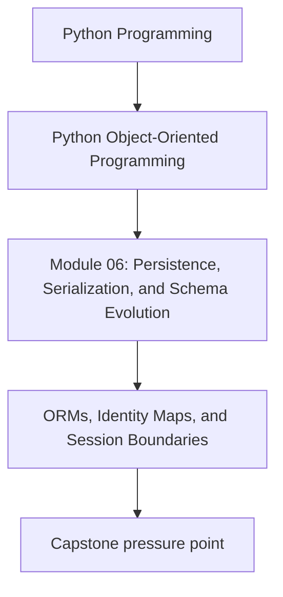
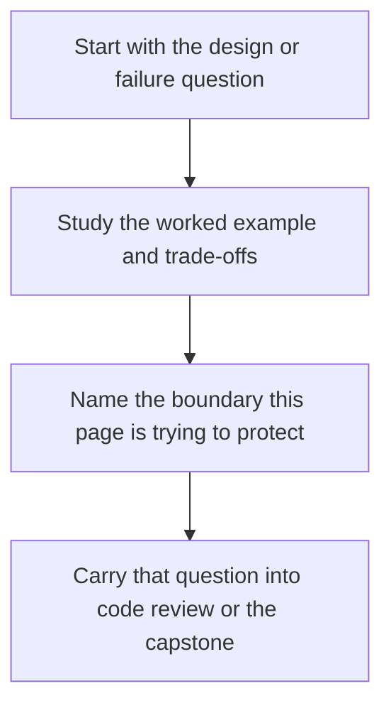

# ORMs, Identity Maps, and Session Boundaries

<!-- page-maps:start -->
## Concept Position

<!-- page-maps:end -->

Read the first diagram as a placement map: this page is one concept inside its parent module, not a detached essay, and the capstone is the pressure test for whether the idea holds. Read the second diagram as the working rhythm for the page: name the problem, study the example, identify the boundary, then carry one review question forward.

## Purpose

ORMs are useful tools, but they become dangerous when their session model silently takes
over object identity, loading rules, and transaction boundaries. This page explains how
identity maps and sessions interact with domain design so persistence does not quietly
become the real architecture of the system.

## Why this topic matters

Many object-oriented Python systems degrade here:

- the ORM model becomes the domain model
- identity is controlled by the session instead of the aggregate boundary
- lazy loading hides I/O behind ordinary-looking attribute access
- writes happen because objects were touched, not because a use case decided to commit

If the course does not address this directly, it leaves one of the biggest real-world
corruption paths under-taught.

## Identity map: useful and dangerous

An identity map ensures that one session returns the same in-memory object for the same
stored identity. That can reduce duplication and support change tracking.

But it also creates design pressure:

- equality and identity can look “correct” only inside one session
- hidden mutation can become coupled to session lifetime
- tests may pass only because session behavior masks poor aggregate boundaries

The identity map is a persistence convenience, not the definition of domain identity.

## Session boundary

A session answers questions like:

- how long does loaded state stay attached?
- when do writes become durable?
- who is allowed to lazy-load related state?

If those rules are unclear, repository and unit-of-work contracts become performative.

## Lazy loading is not free

Lazy loading can be useful, but it changes the object contract:

- attribute access may perform I/O
- iteration over relationships may depend on open session state
- detached objects may fail in surprising places

That does not mean lazy loading is always wrong. It means it must remain visible at the
boundary and never be mistaken for ordinary in-memory behavior.

## A sane boundary rule

Use this split:

- repositories and mappers manage session and record translation
- aggregates remain domain objects with explicit invariants
- unit of work defines commit scope
- query models handle read-heavy or projection-heavy paths

That way the ORM stays an implementation tool instead of becoming the dominant model.

## What to review in ORM-heavy code

- Can you tell where the session begins and ends?
- Are aggregates still authoritative, or are ORM entities carrying accidental domain logic?
- Does any innocent-looking property access trigger hidden I/O?
- Are detached, stale, or conflicting writes handled explicitly?

## Practical guidelines

- Keep session lifetime short and explicit.
- Treat identity-map behavior as a persistence concern, not a domain guarantee.
- Avoid lazy-loading surprises on hot paths or public APIs.
- Prefer explicit mapping or repository seams when the ORM model wants to leak inward.

## Exercises for mastery

1. Review one ORM-backed design and mark where session lifetime is visible versus hidden.
2. Identify one place where lazy loading changes the apparent object contract.
3. Rewrite one persistence boundary so the repository returns an aggregate or explicit read model instead of raw ORM entities.
