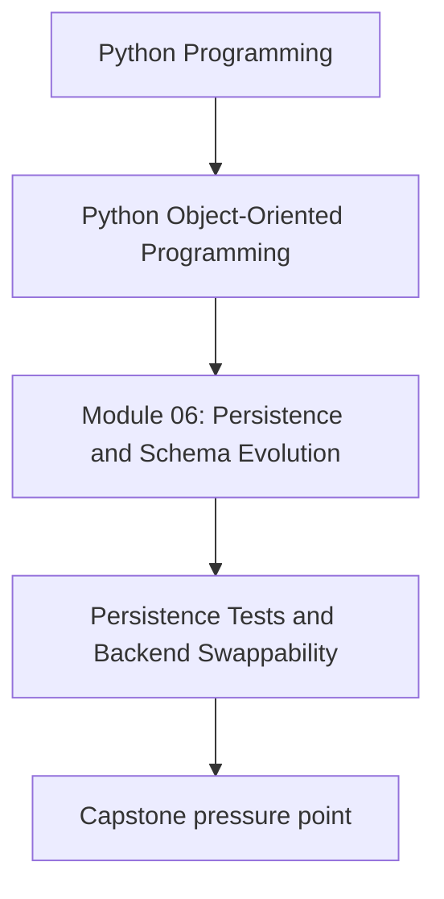
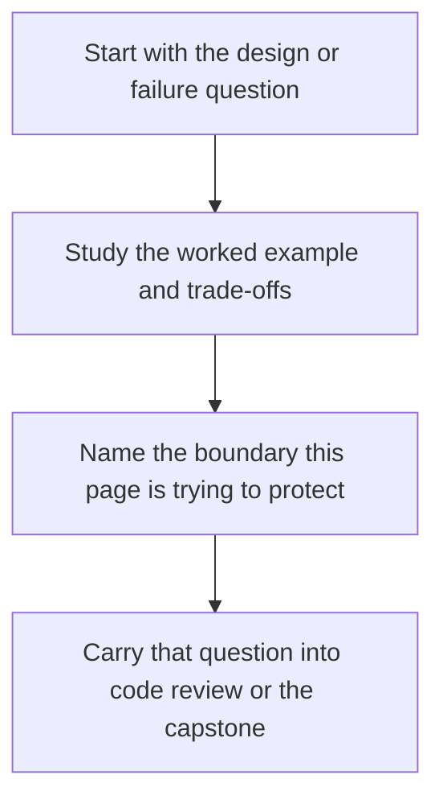

# Persistence Tests and Backend Swappability

<!-- page-maps:start -->
## Concept Position

<!-- page-maps:end -->

Read the first diagram as a placement map: this page is one concept inside its parent module, not a detached essay, and the capstone is the pressure test for whether the idea holds. Read the second diagram as the working rhythm for the page: name the problem, study the example, identify the boundary, then carry one review question forward.

## Purpose

Verify repository behavior as a contract so backend changes do not silently alter domain
semantics.

## 1. Repository Contracts Need Executable Proof

If you promise that every repository implementation:

- preserves invariants,
- detects stale writes,
- round-trips aggregates faithfully,

then those promises need tests that every backend must pass.

## 2. Contract Tests Beat One-Off Happy Paths

Write backend-agnostic tests once, then run them against:

- an in-memory repository
- a file-backed repository
- a database-backed repository

That gives you storage flexibility without semantic drift.

## 3. Test Real Failure Modes

Focus on behaviors that often change across backends:

- missing aggregate semantics
- duplicate identity handling
- version conflicts
- codec mismatch

Do not stop at “save then load works once.”

## 4. Swappability Has a Cost

Not every backend deserves full interchangeability. Sometimes backend differences are
real and should appear in separate contracts. Swappability is valuable only when the
shared contract is honest.

## Practical Guidelines

- Write backend-independent repository contract tests.
- Include corruption, conflict, and missing-object cases.
- Share fixtures across implementations to keep expectations aligned.
- Split contracts when backend capabilities truly differ.

## Exercises for Mastery

1. Write one repository contract test and run it against two implementations.
2. Add a failure case for a stale save or malformed stored payload.
3. Decide whether one backend-specific behavior belongs in the shared contract or outside it.
