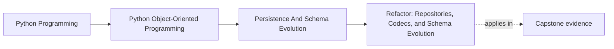
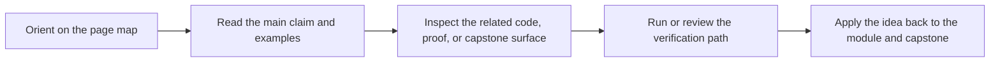

# Refactor: Repositories, Codecs, and Schema Evolution

<!-- page-maps:start -->
## Page Maps

<!-- page-maps:end -->

## Goal

Extend the monitoring-system capstone from an in-memory-only persistence story to a
storage-aware design without letting persistence details invade the aggregate.

## Refactor Outline

1. Define a repository contract in aggregate language.
2. Introduce explicit record mappers and a boundary codec for serialized policy state.
3. Add a version field to the serialized representation and an upcaster for one older shape.
4. Add optimistic concurrency tokens to persisted aggregates.
5. Keep publish-after-save behavior coordinated through the unit of work instead of the aggregate.

## What to Watch For

- Domain objects should still reject invalid state after rehydration.
- Storage record types should stay separate from core domain types.
- Conflict detection should surface as an explicit application error, not silent overwrite.
- Compatibility rules should live in codec and migration code, not in random domain methods.

## Suggested Verification

- round-trip an aggregate through the codec and repository
- load an older payload through the upcaster path
- demonstrate a stale-write conflict with two loads of the same aggregate
- verify that queued publications stay aligned with commit boundaries

## Review Questions

1. Which part of the design now owns storage-shape knowledge?
2. Did any domain method start accepting raw persisted payloads or row-like data?
3. Can an unsupported schema version fail fast with a readable error?
4. Is there any last-write-wins behavior that remains accidental?
