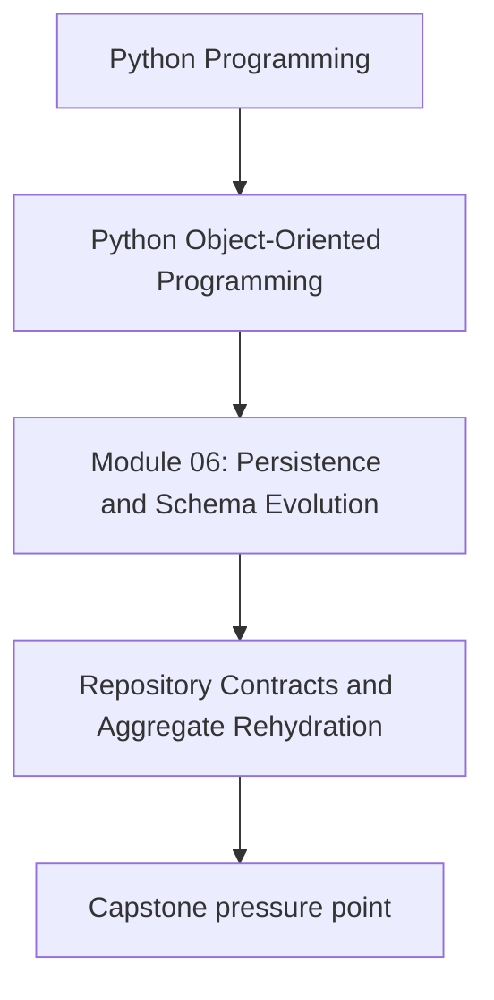
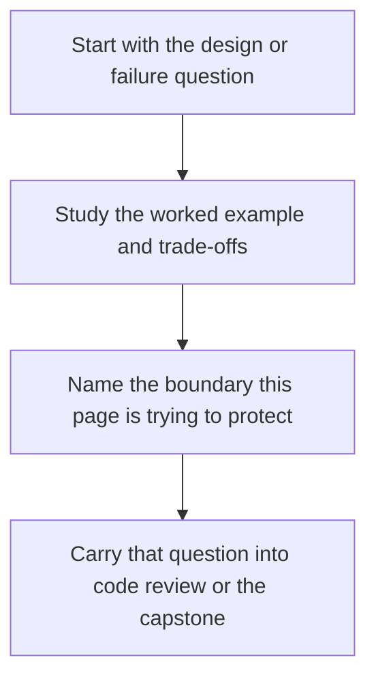

# Repository Contracts and Aggregate Rehydration

<!-- page-maps:start -->
## Concept Position

<!-- page-maps:end -->

Read the first diagram as a placement map: this page is one concept inside its parent module, not a detached essay, and the capstone is the pressure test for whether the idea holds. Read the second diagram as the working rhythm for the page: name the problem, study the example, identify the boundary, then carry one review question forward.

## Purpose

Define repositories as narrow contracts for loading and saving authoritative domain
objects, not as generic data-access grab bags.

## 1. Repository Means Domain Language

A repository should speak in aggregate terms:

- `load_policy(policy_id) -> MonitoringPolicy`
- `save_policy(policy)`

It should not force callers to assemble aggregates from loose rows, dicts, or ORM
entities. Rehydration belongs inside the repository boundary.

## 2. Rehydration Must Reuse Domain Invariants

A repository that constructs objects by bypassing domain rules is a corruption point.
If persisted data is invalid, loading should fail loudly or route through an explicit
repair path.

Rule: storage is not a license to create impossible objects.

## 3. Keep Queries Honest

Not every read belongs in the repository:

- authoritative aggregate loads do
- projection and reporting queries often do not

If you need dashboards, search views, or audit tables, model them as read models or
query services instead of widening the aggregate repository.

## 4. Repositories Are Not Unit-of-Work Replacements

The repository answers "how do I rehydrate and save this aggregate?"

The unit of work answers "which changes commit together?"

Do not hide commit semantics inside random repository methods.

## Practical Guidelines

- Expose aggregate-shaped methods instead of generic CRUD primitives.
- Rehydrate through constructors, factories, or explicit loaders that preserve invariants.
- Keep reporting queries outside aggregate repositories unless they truly return authoritative objects.
- Separate repository concerns from commit and rollback concerns.

## Exercises for Mastery

1. Rewrite one repository interface in aggregate language instead of table language.
2. Add a test proving that corrupted persisted data cannot be rehydrated silently.
3. Split one reporting query out of a repository into a projection or query service.
