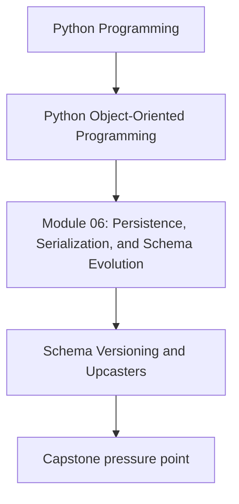
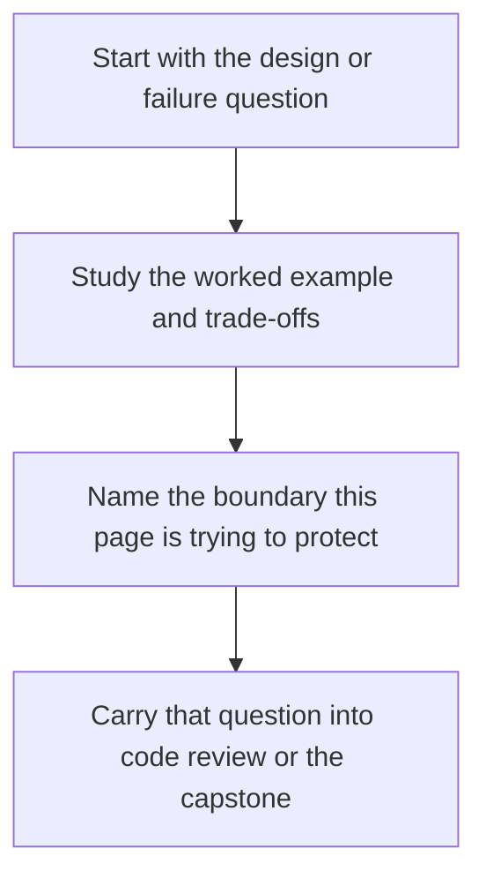

# Schema Versioning and Upcasters


<!-- page-maps:start -->
## Concept Position




<!-- page-maps:end -->

Read the first diagram as a placement map: this page is one concept inside its parent module, not a detached essay, and the capstone is the pressure test for whether the idea holds. Read the second diagram as the working rhythm for the page: name the problem, study the example, identify the boundary, then carry one review question forward.

## Purpose

Evolve serialized data safely by making version changes explicit and reversible.

## 1. Old Data Will Outlive Today’s Code

If your system persists files, rows, or messages, yesterday's shape will still exist
after tomorrow's deploy. Schema evolution is not a future concern. It begins with the
first persisted artifact.

## 2. Add Version Markers Early

A payload without a version field forces you to guess which rules should parse it.
Prefer explicit markers:

```python
{"version": 2, "rule": {...}}
```

Version markers make compatibility decisions reviewable.

## 3. Upcasters Translate Old Shapes Forward

An upcaster converts an older schema into the current one before domain loading:

- rename fields
- provide defaults for newly required data
- split one field into several

Keep upcasters small and ordered. They should describe data-shape repair, not inject
new business meaning.

## 4. Avoid “Support Everything Forever” by Accident

Compatibility windows need policy. You may support versions 1-3 now and reject 0.
That is healthier than silently carrying dead formats for years.

## Practical Guidelines

- Include explicit schema versions in persisted and transported artifacts.
- Upgrade old payloads before constructing domain objects.
- Keep upcasters focused on shape translation, not domain behavior.
- Document the compatibility window you intend to support.

## Exercises for Mastery

1. Add a version marker to one serialized payload format.
2. Write an upcaster from version 1 to version 2 and test it.
3. Decide which old version your system should stop supporting and explain why.
