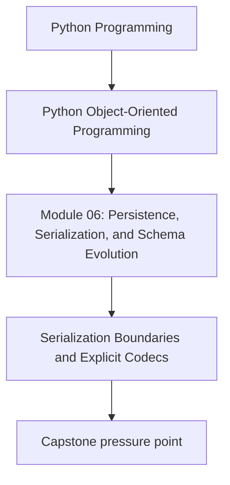
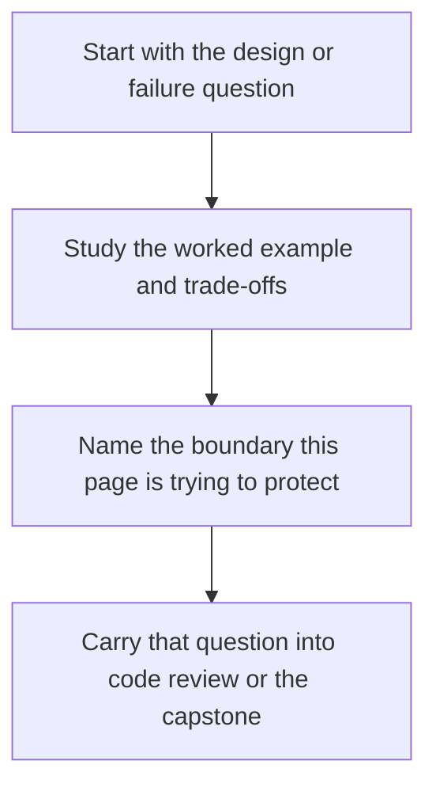

# Serialization Boundaries and Explicit Codecs


<!-- page-maps:start -->
## Concept Position




<!-- page-maps:end -->

Read the first diagram as a placement map: this page is one concept inside its parent module, not a detached essay, and the capstone is the pressure test for whether the idea holds. Read the second diagram as the working rhythm for the page: name the problem, study the example, identify the boundary, then carry one review question forward.

## Purpose

Use explicit codecs to serialize domain state so external formats stay stable without
turning serialization into hidden behavior on every object.

## 1. Serialization Is a Boundary Contract

JSON, YAML, message payloads, and file snapshots are contracts with another process,
another version of your code, or another team. Treat them as public surfaces.

That means you should know:

- which version you are emitting
- which fields are required
- which types need explicit encoding rules

## 2. Keep Codec Logic near the Boundary

Avoid domain methods like `to_json()` on every core type unless serialization is truly
intrinsic to the type's meaning. More often, a boundary codec is cleaner:

```python
class PolicyCodec:
    def dump(self, policy: MonitoringPolicy) -> dict[str, object]: ...
    def load(self, payload: dict[str, object]) -> MonitoringPolicy: ...
```

This keeps the core free of transport choices.

## 3. Encode Intent, Not Accident

If a timestamp must be UTC, encode it explicitly.
If a value object wraps a string, emit the semantic field name, not an anonymous tuple.

Ambiguous serialization becomes expensive when format consumers multiply.

## 4. Fail Fast on Unknown or Incompatible Data

Silent coercion feels convenient until it hides a broken producer. Prefer strict codecs
that reject malformed payloads early, then add compatibility shims deliberately.

## Practical Guidelines

- Treat serialization formats as versioned contracts.
- Use explicit codec objects or functions instead of scattering `json.dumps` calls.
- Encode semantic meaning clearly, especially for timestamps, enums, and identifiers.
- Reject malformed or incompatible payloads before they reach the domain model.

## Exercises for Mastery

1. Build a codec for one aggregate and test round-trip behavior.
2. Add a failing test for an unknown field or malformed value.
3. Remove one `to_dict()` shortcut from a domain class and replace it with a boundary codec.
