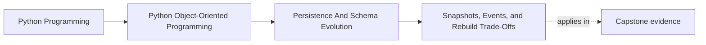
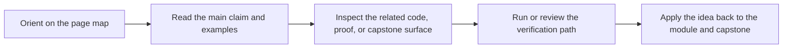

# Snapshots, Events, and Rebuild Trade-Offs

<!-- page-maps:start -->
## Page Maps

<!-- page-maps:end -->

## Purpose

Choose deliberately between persisting current state, historical events, or both.

## 1. Snapshots Optimize Simplicity

A snapshot stores the latest authoritative state of an aggregate. It is usually the
easiest persistence model to explain and load.

Use snapshots when:

- current state matters more than replayable history
- rebuild cost is low
- audit requirements are modest

## 2. Event Histories Optimize Explanation

Event streams preserve how state changed over time. They help with auditability and
temporal reasoning, but they increase operational and conceptual cost.

Do not adopt event storage just because domain events exist in-process.

## 3. Hybrid Designs Are Common

Many systems keep snapshots as the load path and append meaningful events for audit or
downstream subscribers. The key is to keep one source of truth clear.

If both are persisted, decide which artifact is authoritative for rebuild.

## 4. Match Storage Strategy to Review Pressure

Ask:

- Do we need history for legal or operational reasons?
- How expensive is replay?
- Who will debug data drift when snapshots and events disagree?

Storage strategy is a governance decision as much as a coding decision.

## Practical Guidelines

- Start with snapshots unless replayable history is a real requirement.
- Persist events only when you can justify their operational cost.
- If you store both snapshots and events, document which artifact is authoritative.
- Test rebuild paths explicitly; do not assume snapshot and event streams agree.

## Exercises for Mastery

1. Write down whether one aggregate in your system needs snapshots, events, or both, and why.
2. Add a test that rebuilds an aggregate from the persistence strategy you chose.
3. Identify one in-process domain event that should not automatically become a stored event.
