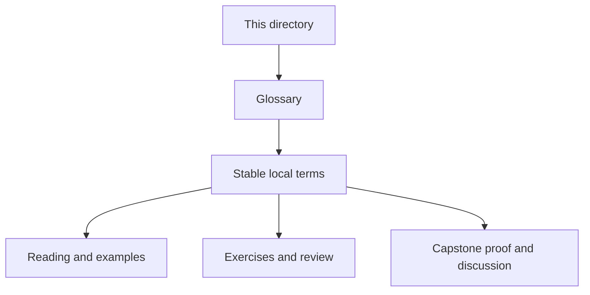
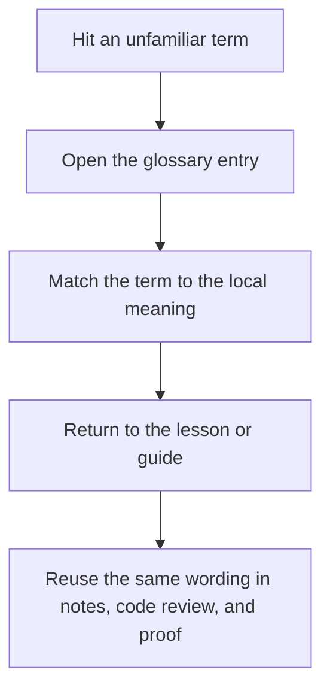

# Module Glossary

<!-- page-maps:start -->
## Glossary Fit

<!-- page-maps:end -->

This glossary belongs to **Module 06: Persistence, Serialization, and Schema Evolution** in **Python Object-Oriented Programming**. It keeps the language of this directory stable so the same ideas keep the same names across reading, practice, review, and capstone proof.

## How to use this glossary

Read the directory index first, then return here whenever a page, command, or review discussion starts to feel more vague than the course intends. The goal is stable language, not extra theory.

## Terms in this directory

| Term | Meaning in this directory |
| --- | --- |
| Mapping Domain Objects to Storage Models | the module's treatment of mapping domain objects to storage models, used to make the module's main design claim concrete in design work, refactoring, and capstone evidence. |
| Migrating Stored Data without Domain Corruption | the module's treatment of migrating stored data without domain corruption, used to make the module's main design claim concrete in design work, refactoring, and capstone evidence. |
| Optimistic Concurrency and Conflict Detection | the module's treatment of optimistic concurrency and conflict detection, used to make the module's main design claim concrete in design work, refactoring, and capstone evidence. |
| ORMs, Identity Maps, and Session Boundaries | the module's treatment of orms, identity maps, and session boundaries, used to make the module's main design claim concrete in design work, refactoring, and capstone evidence. |
| Persistence Tests and Backend Swappability | the module's treatment of persistence tests and backend swappability, used to make the module's main design claim concrete in design work, refactoring, and capstone evidence. |
| Refactor: Repositories, Codecs, and Schema Evolution | the module's treatment of refactor: repositories, codecs, and schema evolution, used to make the module's main design claim concrete in design work, refactoring, and capstone evidence. |
| Repository Contracts and Aggregate Rehydration | the module's treatment of repository contracts and aggregate rehydration, used to make the module's main design claim concrete in design work, refactoring, and capstone evidence. |
| Schema Versioning and Upcasters | the module's treatment of schema versioning and upcasters, used to make the module's main design claim concrete in design work, refactoring, and capstone evidence. |
| Serialization Boundaries and Explicit Codecs | the module's treatment of serialization boundaries and explicit codecs, used to make the module's main design claim concrete in design work, refactoring, and capstone evidence. |
| Snapshots, Events, and Rebuild Trade-Offs | the module's treatment of snapshots, events, and rebuild trade-offs, used to make the module's main design claim concrete in design work, refactoring, and capstone evidence. |
| Transactional Boundaries and Outbox Thinking | the module's treatment of transactional boundaries and outbox thinking, used to make the module's main design claim concrete in design work, refactoring, and capstone evidence. |
