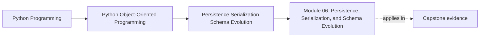
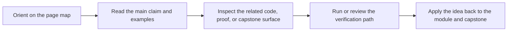

# Module 06: Persistence, Serialization, and Schema Evolution

<!-- page-maps:start -->
## Page Maps

<!-- page-maps:end -->

Read the first diagram as a placement map: this page sits between the course promise, the lesson pages listed below, and the capstone surfaces that pressure-test the module. Read the second diagram as the study route for this page, so the diagrams point you toward the `Lesson map`, `Exercises`, and `Closing criteria` instead of acting like decoration.

Objects do not stop being objects when they cross a process boundary. This module
teaches how to persist aggregates, serialize state, and evolve stored representations
without letting storage concerns dissolve the domain model.

Keep one question in view while reading:

> Which part of this data shape is a domain contract, and which part is only a storage representation that should stay replaceable?

That question is what prevents persistence from flattening the model into records.

## Preflight

- You should already be able to describe aggregate ownership and state contracts before adding storage concerns.
- If repository, codec, and schema boundaries still feel interchangeable, keep the domain/storage distinction visible while reading.
- Treat persistence as translation work that must preserve meaning, not as permission to flatten the model.

## Learning outcomes

- define repository and codec contracts that preserve domain meaning across storage boundaries
- separate domain objects from storage records, session state, and serialized representations
- design schema evolution and compatibility strategies before old data becomes a production problem
- review conflict detection and transactional publication as part of persistence semantics

## Why this module matters

Many Python systems start with a clean object model and lose discipline the moment
they touch a database, a message payload, or a file format. Repositories become
opaque bags of side effects, JSON shapes leak into domain methods, and old data
silently becomes incompatible with new code.

This module treats persistence as another design boundary that must preserve object
semantics instead of flattening them away.

## Main questions

- What contract should a repository expose to the rest of the system?
- How do you translate between domain objects and storage records without leaking schemas inward?
- How do sessions, identity maps, and lazy loading change the object contract?
- When should you serialize snapshots, events, or both?
- How do you version stored data and upgrade old representations safely?
- How do you detect conflicting writes without pretending concurrency does not exist?

## Reading path

1. Start with repository contracts, mappings, and codecs.
2. Then study sessions, identity maps, snapshots, schema versioning, and conflict detection as one evolution cluster.
3. Move into transactional publication, testing, and migration strategy after the storage boundary is clear.
4. Finish with the refactor chapter to see persistence added without corrupting the domain.

## Lesson map

- [Repository Contracts and Aggregate Rehydration](repository-contracts-and-aggregate-rehydration.md)
- [Mapping Domain Objects to Storage Models](mapping-domain-objects-to-storage-models.md)
- [Serialization Boundaries and Explicit Codecs](serialization-boundaries-and-explicit-codecs.md)
- [ORMs, Identity Maps, and Session Boundaries](orms-identity-map-and-session-boundaries.md)
- [Snapshots, Events, and Rebuild Trade-Offs](snapshots-events-and-rebuild-trade-offs.md)
- [Schema Versioning and Upcasters](schema-versioning-and-upcasters.md)
- [Optimistic Concurrency and Conflict Detection](optimistic-concurrency-and-conflict-detection.md)
- [Transactional Boundaries and Outbox Thinking](transactional-boundaries-and-outbox-thinking.md)
- [Persistence Tests and Backend Swappability](persistence-tests-and-backend-swappability.md)
- [Migrating Stored Data without Domain Corruption](migrating-stored-data-without-domain-corruption.md)
- [Refactor: Repositories, Codecs, and Schema Evolution](refactor-repositories-codecs-and-schema-evolution.md)
- [Glossary](glossary.md)

## Keep these support surfaces open

- `../guides/proof-matrix.md` when you want the persistence promise tied to one evidence route.
- `../capstone/capstone-map.md` when you want the repository and proof surfaces kept explicit.
- `../reference/self-review-prompts.md` when you want to test whether storage translation and domain meaning still sound separable.

## First review route for storage boundaries

1. Read `src/service_monitoring/repository.py`.
2. Keep [Capstone Architecture Guide](../capstone/capstone-architecture-guide.md) open while you read.
3. Compare the repository boundary with the unit-of-work proof surface in [Capstone Proof Guide](../capstone/capstone-proof-guide.md).

That route keeps the central distinction visible: the repository may translate and persist
state, but it must not become the place where domain rules are smuggled in or constructors
are bypassed.

## Translation checklist

- Which fields are domain meaning, and which are only storage convenience?
- Which part of the serialized shape may evolve without changing the object contract?
- Which older representation would need a compatibility plan before this change could ship?

## Common failure modes

- letting ORM or JSON models become the domain model by default
- allowing session state or lazy loading to redefine the apparent object contract
- exposing storage-specific identifiers and nullable columns directly to domain code
- changing a serialized shape without a compatibility plan for existing data
- persisting partially valid aggregates because repository code bypasses constructors
- treating write conflicts as impossible until production traffic proves otherwise

## Exercises

- Map one aggregate to a storage representation and name which fields are domain meaning versus storage convenience.
- Review one serialization change and explain how you would preserve compatibility for older persisted data.
- Describe one repository API and justify why it is narrow enough to prevent storage assumptions from leaking inward.

## Capstone connection

The monitoring capstone currently uses an in-memory repository and unit of work.
This module shows how that design can grow into file-backed, database-backed, or
message-driven persistence without changing who owns invariants. Read it as the bridge
between a teachable in-memory model and a production storage boundary.

## Honest completion signal

You are ready to move on when you can explain one persistence change in terms of all
three of these at once:

- what the domain contract is
- what the storage representation is
- what proof surface should fail first if those drift apart

## Closing criteria

You should finish this module able to add persistence, serialization, and schema
change to an object-oriented Python system without sacrificing aggregate integrity
or compatibility discipline.

## Directory glossary

Use [Glossary](glossary.md) when you want the recurring language in this module kept stable while you move between lessons, exercises, and capstone checkpoints.
