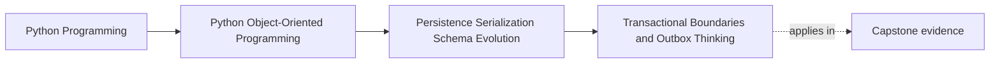
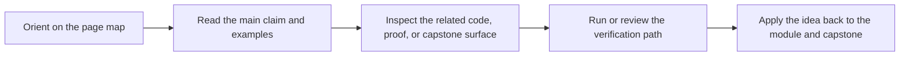

# Transactional Boundaries and Outbox Thinking

<!-- page-maps:start -->
## Page Maps

<!-- page-maps:end -->

Read the first diagram as a placement map: this page is one concept inside its parent module, not a detached essay, and the capstone is the pressure test for whether the idea holds. Read the second diagram as the working rhythm for the page: name the problem, study the example, identify the boundary, then carry one review question forward.

## Purpose

Keep persistence and event publication coherent when saved objects must also trigger
downstream messages or integrations.

## 1. Save and Publish Is a Boundary Pair

If you save an aggregate and then publish a message in a separate step, failures create
drift:

- data saved, message lost
- message published, data not saved

That is not just infrastructure trouble. It changes system meaning.

## 2. The Outbox Idea

An outbox persists domain changes and publishable messages inside the same commit
boundary, then ships the messages later.

You do not need a full distributed architecture to learn from this pattern. The core
point is simpler: publication intent should be stored with persistence intent.

## 3. Keep Domain Events Distinct from Integration Messages

Domain events describe what happened inside the model.
Integration messages describe what another boundary needs to know.

Sometimes they align closely. Sometimes they do not. Avoid assuming they are identical.

## 4. Start Small in Python Services

Even in a small service, you can model:

- pending publications on the unit of work
- durable storage of those publications
- a publisher that drains them after commit

This is enough to teach consistency without hiding it behind framework machinery.

## Practical Guidelines

- Treat save-plus-publish as one design problem.
- Persist publication intent with state changes when downstream delivery matters.
- Distinguish internal domain events from external integration messages.
- Keep publication draining and retry policy outside the domain model.

## Exercises for Mastery

1. Sketch an outbox record for one domain event in your system.
2. Identify one case where a domain event should map to a different external message.
3. Add a test for “saved but not yet published” behavior in a unit-of-work style flow.
