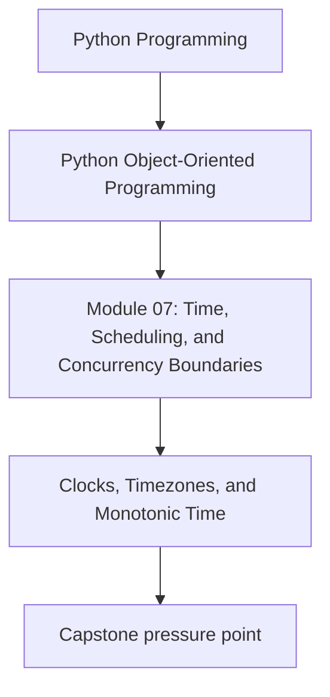
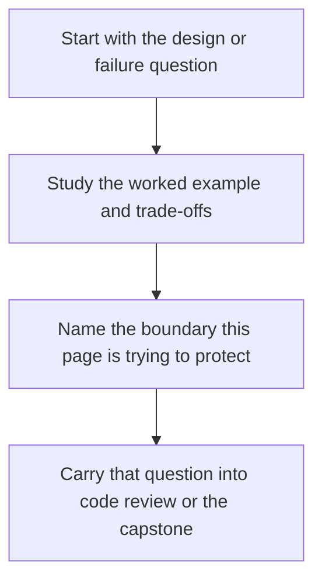

# Clocks, Timezones, and Monotonic Time

<!-- page-maps:start -->
## Concept Position

<!-- page-maps:end -->

Read the first diagram as a placement map: this page is one concept inside its parent module, not a detached essay, and the capstone is the pressure test for whether the idea holds. Read the second diagram as the working rhythm for the page: name the problem, study the example, identify the boundary, then carry one review question forward.

## Purpose

Model time explicitly so your objects do not confuse "what time is it?" with "how much
time has passed?"

## 1. Wall Clock and Elapsed Time Are Different

Use wall-clock time for:

- timestamps shown to humans
- persisted event times
- schedules tied to calendar meaning

Use monotonic time for:

- measuring durations
- timeout budgets
- retry backoff

Mixing them produces subtle bugs.

## 2. Inject Clocks Instead of Calling `now()` Everywhere

Objects that care about time should depend on a clock abstraction or value supplied by
their caller. That keeps tests deterministic and makes timezone policy explicit.

## 3. Timezone Rules Belong at the Boundary

Persist and compare timestamps in a stable representation such as aware UTC values.
Translate to local time only where presentation or user input requires it.

## 4. Time Is Data, Not Ambient Magic

If expiration depends on `recorded_at`, make that field visible in the model. Hidden
time capture inside methods creates behavior that callers cannot reason about.

## Practical Guidelines

- Distinguish timestamp capture from duration measurement.
- Inject clocks or timestamps instead of calling `datetime.now()` deep in the domain.
- Store time in aware, explicit representations.
- Prefer monotonic clocks for timeout and retry math.

## Exercises for Mastery

1. Replace one hidden call to `now()` with an injected clock or timestamp.
2. Write a test that proves a timeout calculation uses monotonic time.
3. Audit one persisted timestamp and document its timezone contract.
