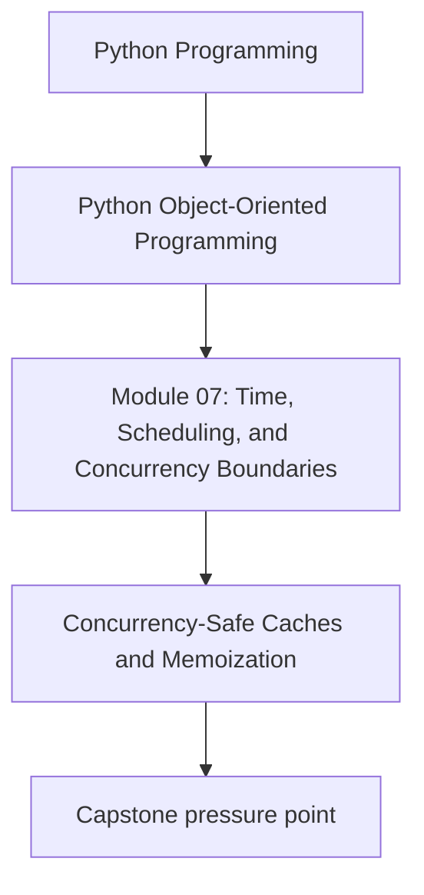
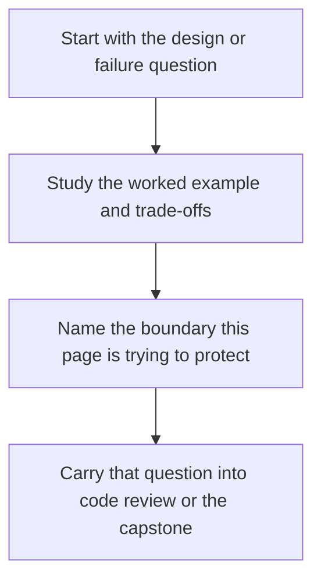

# Concurrency-Safe Caches and Memoization

<!-- page-maps:start -->
## Concept Position

<!-- page-maps:end -->

Read the first diagram as a placement map: this page is one concept inside its parent module, not a detached essay, and the capstone is the pressure test for whether the idea holds. Read the second diagram as the working rhythm for the page: name the problem, study the example, identify the boundary, then carry one review question forward.

## Purpose

Cache results without widening race conditions, staleness bugs, or hidden temporal
coupling inside your object model.

## 1. Cache What You Can Explain

Cached values need answers to four questions:

- what is cached
- who owns invalidation
- how long it remains valid
- whether concurrent reads and writes are safe

If you cannot answer those, the cache is speculation.

## 2. Mutable Cached Objects Are a Trap

Returning the same mutable object instance from a shared cache often creates aliasing
and thread-safety bugs. Immutable values or defensive copies are safer defaults.

## 3. Memoization Has Temporal Semantics

Memoization is not "free speed." It changes when work happens and how stale data can be.
That makes it part of the behavioral contract.

## 4. Synchronize Around Cache Population Carefully

Double-fetch races, cache stampedes, and partially populated entries are common. Choose
locking or single-flight strategies deliberately.

## Practical Guidelines

- Define invalidation, freshness, and ownership before adding a cache.
- Prefer immutable cached values or copies.
- Treat memoization as a behavior change, not just a performance trick.
- Protect cache population against duplicate work where it matters.

## Exercises for Mastery

1. Audit one cache and document its invalidation owner.
2. Replace one mutable cached object with an immutable value or copy-on-read strategy.
3. Add a concurrency test for duplicate cache population or stale reads.
