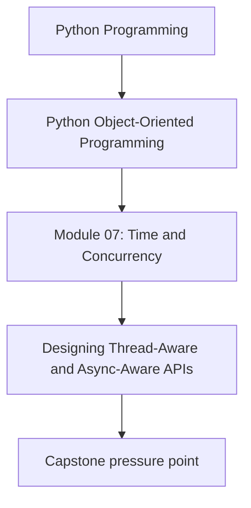
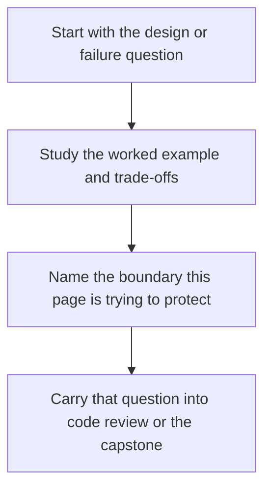

# Designing Thread-Aware and Async-Aware APIs

<!-- page-maps:start -->
## Concept Position

<!-- page-maps:end -->

Read the first diagram as a placement map: this page is one concept inside its parent module, not a detached essay, and the capstone is the pressure test for whether the idea holds. Read the second diagram as the working rhythm for the page: name the problem, study the example, identify the boundary, then carry one review question forward.

## Purpose

Expose concurrency expectations clearly in public APIs so callers know the cost and
lifecycle implications of using an object.

## 1. Concurrency Semantics Are Public Semantics

If an API is safe only from one thread, or only inside an event loop, that fact belongs
in the API contract just as much as argument types do.

## 2. Avoid One Interface That Lies to Everyone

A single class that tries to be:

- synchronous,
- asynchronous,
- thread-safe,
- and cancellation-aware

often becomes confusing. Separate entrypoints are usually clearer.

## 3. Name Blocking and Async Behavior Honestly

Use naming, documentation, or distinct types so callers can see whether a method blocks,
spawns work, or must be awaited.

## 4. Composition Roots Own Wiring Choices

The place that chooses worker pools, event loops, or adapter implementations should be
outside the domain model. Public APIs should consume those capabilities rather than
constructing them implicitly.

## Practical Guidelines

- Document thread and event-loop expectations in public APIs.
- Prefer separate sync and async entrypoints when behavior truly differs.
- Make blocking, awaiting, and background execution visible to callers.
- Keep concurrency wiring in composition roots and runtime layers.

## Exercises for Mastery

1. Rewrite one ambiguous API docstring to describe its thread or async contract clearly.
2. Split one overloaded sync/async interface into clearer entrypoints.
3. Identify one place where concurrency infrastructure is constructed too deep in the codebase.
