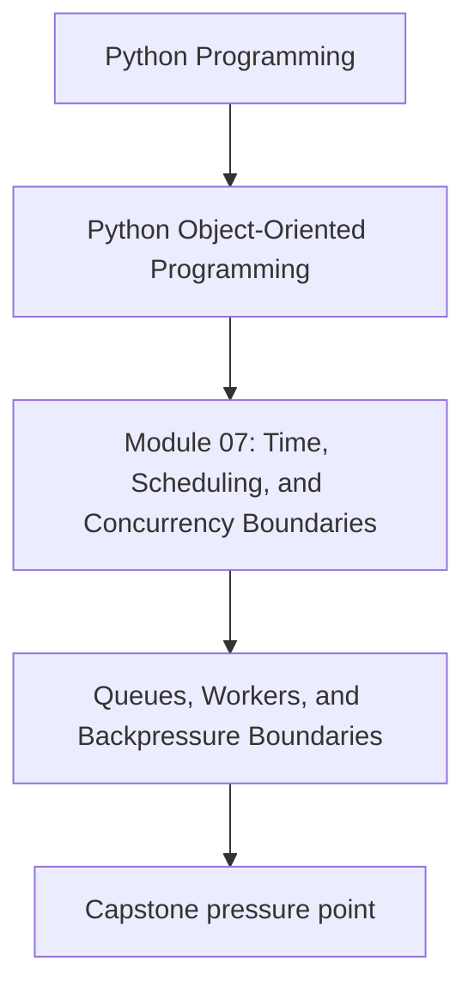
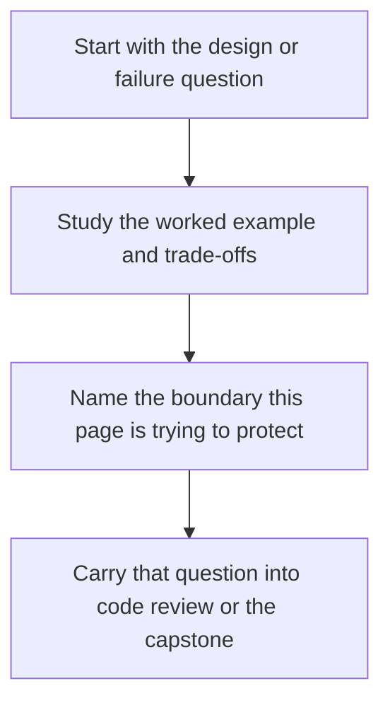

# Queues, Workers, and Backpressure Boundaries

<!-- page-maps:start -->
## Concept Position

<!-- page-maps:end -->

Read the first diagram as a placement map: this page is one concept inside its parent module, not a detached essay, and the capstone is the pressure test for whether the idea holds. Read the second diagram as the working rhythm for the page: name the problem, study the example, identify the boundary, then carry one review question forward.

## Purpose

Use queues and worker handoff to control concurrency explicitly instead of letting
callers overwhelm shared resources.

## 1. A Queue Is a Boundary, Not Just a Buffer

When work crosses a queue, ownership changes:

- producers enqueue requests
- workers own execution
- the queue enforces capacity and ordering policy

That is a meaningful architectural boundary.

## 2. Backpressure Must Be a Deliberate Policy

If workers cannot keep up, the system must choose:

- block producers
- drop work
- shed lower-priority tasks
- persist for later retry

Every choice changes user-visible behavior.

## 3. Queue Payloads Should Be Commands or Stable Messages

Do not pass live mutable objects through queues if workers might outlive the producer's
assumptions. Prefer immutable commands, identifiers, or serialized work items.

## 4. Worker Pools Need Clear Failure Semantics

What happens when one worker crashes?
Who retries?
Who marks work dead?

Backpressure and retry policy belong together.

## Practical Guidelines

- Treat queues as ownership and capacity boundaries.
- Decide backpressure behavior explicitly.
- Pass stable commands or immutable payloads to workers.
- Define crash, retry, and dead-letter behavior before load arrives.

## Exercises for Mastery

1. Document the backpressure policy for one queue in your system.
2. Replace one queue payload that carries a live object with a stable command or identifier.
3. Add a failure scenario describing what happens when a worker crashes mid-task.
