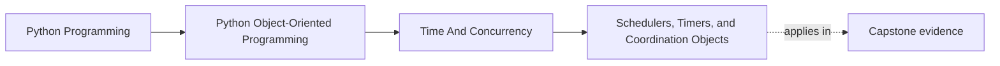

# Schedulers, Timers, and Coordination Objects

<!-- page-maps:start -->
## Page Maps

<!-- page-maps:end -->

## Purpose

Coordinate periodic or delayed work without smuggling scheduling concerns into domain
entities and aggregates.

## 1. Scheduling Is Orchestration

“Run evaluation every minute” is usually an application or runtime concern, not an
aggregate method. The domain should expose what to do, while a scheduler decides when.

## 2. Coordination Objects Clarify Responsibility

A scheduler-facing object can own:

- polling cadence
- retry windows
- worker handoff

This keeps entities from becoming timer-driven mini-frameworks.

## 3. Timer Callbacks Need Stable Commands

Timer-driven systems are easiest to reason about when scheduled jobs call explicit
application commands, not arbitrary internal methods.

## 4. Delayed Work Still Needs Idempotence

Timers can fire twice, late, or after process restarts. Scheduled commands should be
safe under those conditions or detect duplication explicitly.

## Practical Guidelines

- Keep scheduling concerns in runtime or application objects.
- Schedule stable commands, not random internal methods.
- Design delayed work to tolerate duplicate or late execution.
- Give coordination objects clear ownership of cadence and worker handoff.

## Exercises for Mastery

1. Move one timer or cron-like concern out of a domain class into an application object.
2. Define the command surface a scheduler should call in your system.
3. Add an idempotence check for one scheduled operation.
