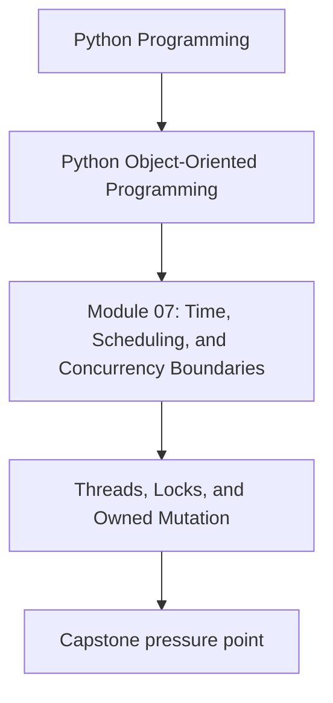
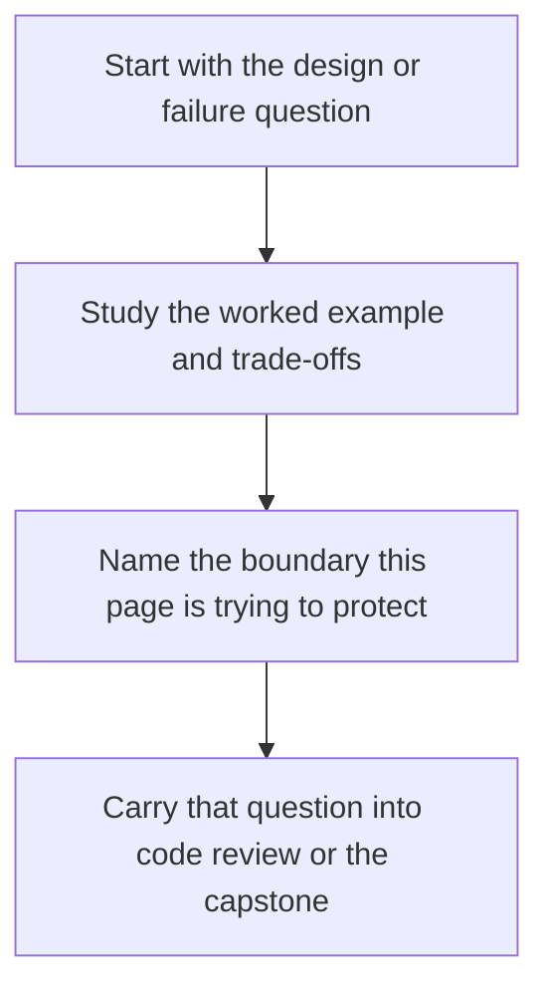

# Threads, Locks, and Owned Mutation

<!-- page-maps:start -->
## Concept Position

<!-- page-maps:end -->

Read the first diagram as a placement map: this page is one concept inside its parent module, not a detached essay, and the capstone is the pressure test for whether the idea holds. Read the second diagram as the working rhythm for the page: name the problem, study the example, identify the boundary, then carry one review question forward.

## Purpose

Protect mutable state by giving it a clear owner instead of assuming incidental thread
safety will hold under load.

## 1. Shared Mutation Is a Design Choice

When multiple threads can mutate the same object, you need a policy:

- one owner thread
- internal locking
- immutable snapshots with replacement

The correct answer depends on workload, but “probably fine” is not a policy.

## 2. Locks Protect Invariants, Not Just Lines of Code

If an invariant spans several fields, the lock boundary must cover the full update.
Per-attribute locking often gives a false sense of safety.

## 3. Prefer Ownership Transfer When Possible

Queues, message passing, or immutable copies often produce simpler designs than sharing
one mutable aggregate across threads.

## 4. Document Thread Expectations

Callers need to know whether an object is:

- single-threaded only
- internally synchronized
- safe only for concurrent reads

Thread semantics are part of the public contract.

## Practical Guidelines

- Choose an explicit state-ownership policy for mutable objects.
- Lock around invariant-preserving operations, not isolated assignments.
- Prefer ownership transfer or immutable snapshots over shared mutation when practical.
- Document thread-safety guarantees and limits.

## Exercises for Mastery

1. Classify one mutable object in your system by its thread-safety contract.
2. Replace one shared mutable structure with queue-based ownership transfer.
3. Write a test or review note for an invariant that requires a wider lock boundary.
