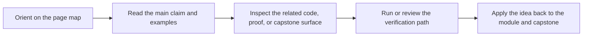

# Asyncio Tasks and Sync-Async Bridges

<!-- page-maps:start -->
## Page Maps

<!-- page-maps:end -->

Read the first diagram as a placement map: this page is one concept inside its parent module, not a detached essay, and the capstone is the pressure test for whether the idea holds. Read the second diagram as the working rhythm for the page: name the problem, study the example, identify the boundary, then carry one review question forward.

## Purpose

Introduce async boundaries deliberately so `async` improves coordination without forcing
the whole object model to become coroutine-shaped.

## 1. Async Is a Boundary Strategy

`asyncio` helps coordinate many waiting operations. It is not a reason to rewrite pure
domain logic as coroutines.

Keep the core synchronous unless the domain itself needs asynchronous composition.

## 2. Blocking Work Must Stay Visible

An `async` wrapper around blocking I/O is still blocking unless you move that work to a
thread pool or a real async client. Hidden blocking breaks latency expectations.

## 3. Bridge at the Edge

Common pattern:

- sync domain and application commands
- async runtime adapters
- a bridge layer that awaits external calls and then invokes synchronous domain logic

That keeps async concerns localized.

## 4. Async APIs Need Lifecycle Rules

Tasks can be cancelled, awaited twice, or leaked. Objects that create tasks must own
their lifetime and shutdown semantics.

## Practical Guidelines

- Keep pure domain logic synchronous unless there is a strong reason otherwise.
- Make blocking behavior explicit inside async code.
- Bridge sync and async concerns near integration boundaries.
- Document who owns created tasks and how they are shut down.

## Exercises for Mastery

1. Identify one part of your codebase that should stay synchronous even if adapters become async.
2. Replace one hidden blocking call inside async code with an explicit bridge.
3. Add shutdown ownership for one object that creates background tasks.
