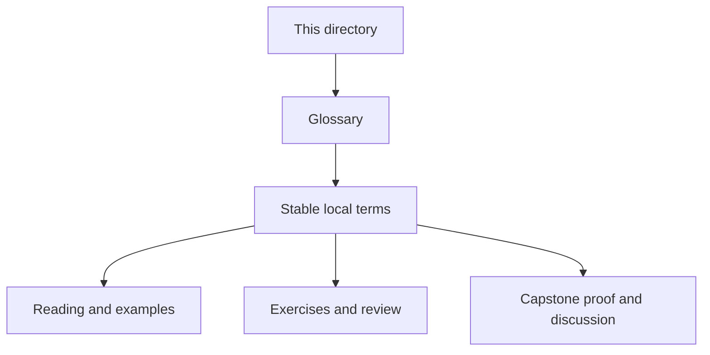
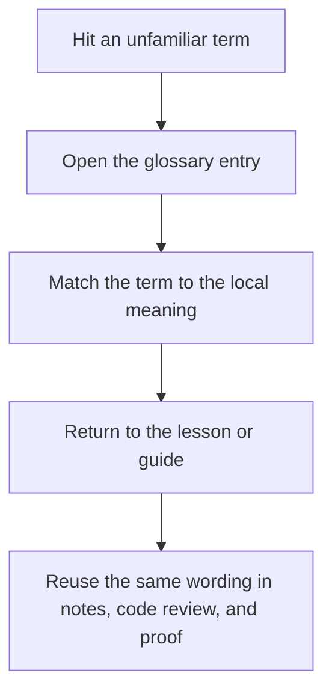

# Module Glossary

<!-- page-maps:start -->
## Glossary Fit

<!-- page-maps:end -->

This glossary belongs to **Module 07: Time, Scheduling, and Concurrency Boundaries** in **Python Object-Oriented Programming**. It keeps the language of this directory stable so the same ideas keep the same names across reading, practice, review, and capstone proof.

## How to use this glossary

Read the directory index first, then return here whenever a page, command, or review discussion starts to feel more vague than the course intends. The goal is stable language, not extra theory.

## Terms in this directory

| Term | Meaning in this directory |
| --- | --- |
| Asyncio Tasks and Sync-Async Bridges | the module's treatment of asyncio tasks and sync-async bridges, used to make the module's main design claim concrete in design work, refactoring, and capstone evidence. |
| Cancellation, Retries, and Resumable Operations | the module's treatment of cancellation, retries, and resumable operations, used to make the module's main design claim concrete in design work, refactoring, and capstone evidence. |
| Clocks, Timezones, and Monotonic Time | the module's treatment of clocks, timezones, and monotonic time, used to make the module's main design claim concrete in design work, refactoring, and capstone evidence. |
| Concurrency-Safe Caches and Memoization | the module's treatment of concurrency-safe caches and memoization, used to make the module's main design claim concrete in design work, refactoring, and capstone evidence. |
| Deadlines, Timeouts, and Expiration Policies | the module's treatment of deadlines, timeouts, and expiration policies, used to make the module's main design claim concrete in design work, refactoring, and capstone evidence. |
| Designing Thread-Aware and Async-Aware APIs | the module's treatment of designing thread-aware and async-aware apis, used to make the module's main design claim concrete in design work, refactoring, and capstone evidence. |
| Queues, Workers, and Backpressure Boundaries | the module's treatment of queues, workers, and backpressure boundaries, used to make the module's main design claim concrete in design work, refactoring, and capstone evidence. |
| Refactor: Runtime around Time and Concurrency Boundaries | the module's treatment of refactor: runtime around time and concurrency boundaries, used to make the module's main design claim concrete in design work, refactoring, and capstone evidence. |
| Schedulers, Timers, and Coordination Objects | the module's treatment of schedulers, timers, and coordination objects, used to make the module's main design claim concrete in design work, refactoring, and capstone evidence. |
| Threads, Locks, and Owned Mutation | the module's treatment of threads, locks, and owned mutation, used to make the module's main design claim concrete in design work, refactoring, and capstone evidence. |
