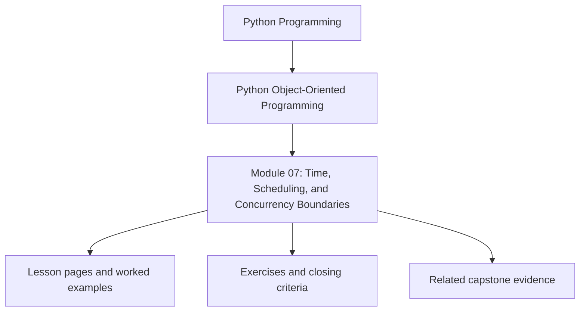
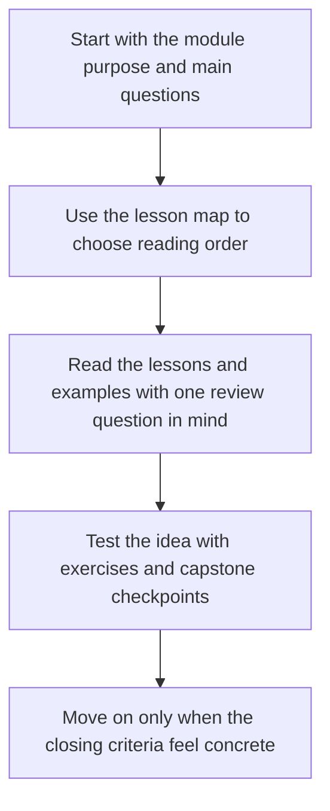

# Module 07: Time, Scheduling, and Concurrency Boundaries

<!-- page-maps:start -->
## Module Position

<!-- page-maps:end -->

Read the first diagram as a placement map: this page sits between the course promise, the lesson pages listed below, and the capstone surfaces that pressure-test the module. Read the second diagram as the study route for this page, so the diagrams point you toward the `Lesson map`, `Exercises`, and `Closing criteria` instead of acting like decoration.

Object models that look clean in single-threaded examples often break when time,
parallel work, or async coordination enters the picture. This module teaches how to
model clocks, deadlines, concurrency, and async boundaries without turning design
semantics into scheduler folklore.

Keep one question in view while reading:

> Which object owns time, cancellation, or concurrency pressure, and which objects should remain ignorant of that pressure?

That question is what keeps runtime concerns explicit instead of contagious.

## Preflight

- You should already be able to separate aggregate ownership from runtime orchestration after the earlier modules.
- If clocks, queues, retries, and async APIs still feel like one generic runtime concern, slow down and separate them by ownership.
- Keep asking whether time and concurrency pressure belongs inside an object or at the boundary coordinating it.

## Learning outcomes

- model clocks, deadlines, cancellation, and concurrency pressure as explicit contracts
- choose between locks, queues, ownership transfer, and async boundaries with design-level reasoning
- distinguish monotonic time from wall-clock time where correctness depends on the difference
- review sync/async bridges without letting scheduler concerns infect the whole model

## Why this module matters

Time and concurrency amplify design mistakes:

- hidden calls to `datetime.now()` make behavior untestable
- shared mutable state turns local changes into races
- async wrappers widen interfaces without clear ownership
- retries and cancellation duplicate side effects unless boundaries are explicit

This module treats temporal and concurrent behavior as part of object design, not as
plumbing to bolt on later.

## Main questions

- Which clock should an object depend on, and why?
- How should deadlines, expiration, and timeouts be represented?
- When do locks belong inside an object, and when are queues or ownership transfer cleaner?
- How do sync and async APIs meet without infecting the whole design?
- How do you design for cancellation and retries without duplicating work?

## Reading path

1. Start with clocks, deadlines, and schedulers.
2. Move into threads, queues, and caches once time semantics are clear.
3. Then study async bridges, cancellation, and API design as one boundary cluster.
4. Finish with the refactor chapter to see the runtime gain temporal discipline without losing readability.

## Keep these support surfaces open

- `../guides/outcomes-and-proof-map.md` when you want the time and concurrency promise tied to a proof route.
- `../guides/pressure-routes.md` when runtime pressure is competing with earlier ownership questions.
- `../reference/self-review-prompts.md` when you want to test whether clocks, cancellation, and retries still sound like boundary decisions.

## Review route for time pressure

1. Read `src/service_monitoring/runtime.py`.
2. Compare it with `capstone/docs/TOUR.md` and `capstone/docs/ARCHITECTURE.md`.
3. Use the runtime tests after you can already say which object should remain ignorant of time, retries, or async concerns.

This route keeps a common mistake visible: once time pressure appears, teams often let
every object learn about clocks, cancellation, or scheduling, even when only the runtime
boundary should absorb that complexity.

## Questions to keep explicit

- Which clock or timeout belongs to the runtime boundary rather than the aggregate?
- Which operation becomes dangerous if retries or cancellation are hidden inside the model?
- Which async bridge should stay at the edge instead of widening every public method?

## Common failure modes

- using wall-clock time where monotonic time is required
- sharing mutable objects across threads without a clear owner
- wrapping synchronous code in async entrypoints without documenting blocking behavior
- treating cancellation as an exception detail instead of a state transition concern
- memoizing mutable or time-sensitive results without invalidation rules

## Exercises

- Pick one operation and explain which clock it should depend on and why a different clock would be unsafe.
- Review one concurrency pressure point and justify whether locking, queuing, or ownership transfer is the cleaner response.
- Compare one sync API and one async wrapper and explain where the boundary should live to keep the domain readable.

## Capstone connection

The monitoring capstone already evaluates live samples and emits incidents. This module
shows how that runtime could grow scheduled polling, worker queues, time-based rules,
and async adapters while preserving aggregate ownership and explicit boundaries.

## Honest completion signal

You are ready to move on when you can point to one proposed concurrency or timing change
and explain:

- which boundary should absorb it
- which objects should stay unaware of it
- which proof surface should fail first if the pressure leaks inward

## Closing criteria

You should finish this module able to design Python object systems that remain clear,
testable, and safe when clocks, worker concurrency, and async integration pressure are real.

## Directory glossary

Use [Glossary](glossary.md) when you want the recurring language in this module kept stable while you move between lessons, exercises, and capstone checkpoints.
