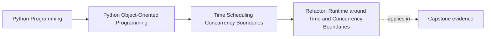
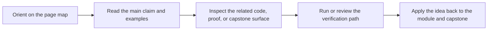

# Refactor: Runtime around Time and Concurrency Boundaries

<!-- page-maps:start -->
## Page Maps

<!-- page-maps:end -->

Read the first diagram as a placement map: this page is one concept inside its parent module, not a detached essay, and the capstone is the pressure test for whether the idea holds. Read the second diagram as the working rhythm for the page: name the problem, study the example, identify the boundary, then carry one review question forward.

## Goal

Extend the monitoring-system runtime so it can schedule sample collection, coordinate
workers, and bridge async adapters without corrupting the aggregate or hiding temporal behavior.

## Refactor Outline

1. Introduce explicit clock and deadline abstractions for time-sensitive behavior.
2. Move polling cadence and timer logic into runtime coordination objects.
3. Hand work to workers through stable commands or queue payloads.
4. Keep aggregate logic synchronous while adding async adapters at the boundary.
5. Make retries, cancellation, and cache policy explicit in runtime orchestration.

## What to Watch For

- The aggregate should not call `now()` or schedule its own timers.
- Queue payloads should not carry live mutable aggregates across worker boundaries.
- Async adapters should not hide blocking calls.
- Retry and cancellation behavior should remain visible above the domain layer.

## Suggested Verification

- test scheduled polling with a fake clock
- prove duplicate queue delivery does not duplicate durable side effects
- verify async bridges surface cancellation and timeout outcomes clearly
- review cache behavior under concurrent access

## Review Questions

1. Which object now owns time and scheduling policy?
2. What state, if any, is intentionally shared across threads?
3. Which API surfaces are sync-only, async-only, or bridge layers?
4. Can you tell what happens if a scheduled action is retried or cancelled?
