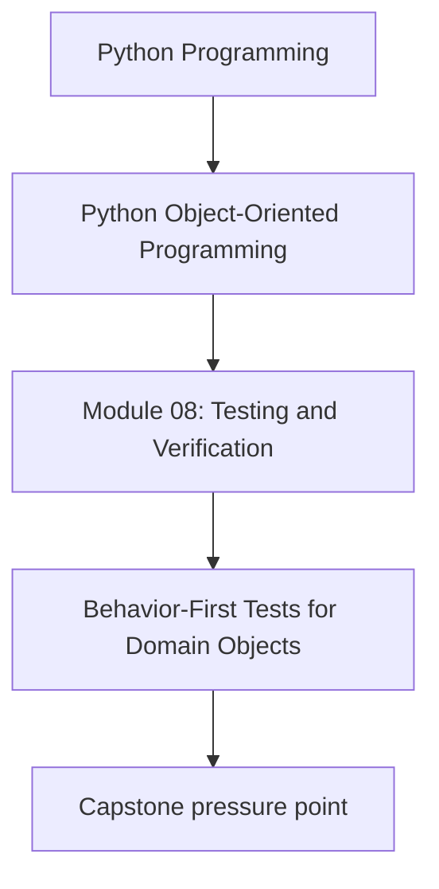
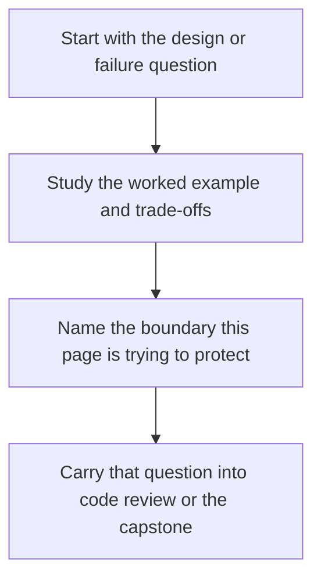

# Behavior-First Tests for Domain Objects

<!-- page-maps:start -->
## Concept Position

<!-- page-maps:end -->

Read the first diagram as a placement map: this page is one concept inside its parent module, not a detached essay, and the capstone is the pressure test for whether the idea holds. Read the second diagram as the working rhythm for the page: name the problem, study the example, identify the boundary, then carry one review question forward.

## Purpose

Test what an object promises to do, not how its current implementation happens to do it.

## 1. Start from the Contract

A good domain-object test answers questions like:

- what state transitions are legal
- which invariants are preserved
- what outputs or events result from a command

It should not start from "which private helper gets called?"

## 2. Favor Public Methods and Observable Outcomes

Public behavior can include:

- returned values
- state changes
- emitted domain events
- raised domain errors

Those are stable review surfaces. Internal call graphs are not.

## 3. Keep Tests Close to Domain Language

If the domain talks about activating rules and emitting incidents, tests should use
that vocabulary. Tests become easier to review when they reinforce the model instead
of narrating implementation trivia.

## 4. Small Objects Still Deserve Meaningful Tests

Value objects and simple policies may need only a few precise tests, but those tests
should still defend equality, validation, and edge behavior explicitly.

## Practical Guidelines

- Test public behavior and outcomes before internal call structure.
- Name tests in domain language.
- Assert on state, returned values, events, and domain errors.
- Keep object tests small, focused, and semantically meaningful.

## Exercises for Mastery

1. Rewrite one interaction-heavy test so it asserts on behavior instead of implementation detail.
2. Add a domain-language test name for one aggregate transition.
3. Review one value object and identify the minimum set of contract tests it needs.
