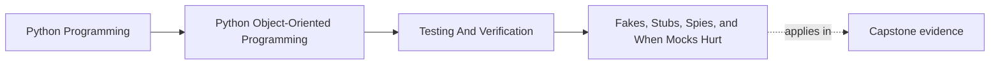
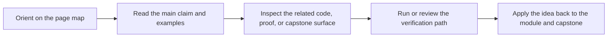

# Fakes, Stubs, Spies, and When Mocks Hurt

<!-- page-maps:start -->
## Page Maps

<!-- page-maps:end -->

## Purpose

Choose the right kind of test double so your tests expose interface meaning instead of
locking behavior to internal call choreography.

## 1. Different Doubles Serve Different Goals

- **stub**: supplies canned answers
- **fake**: provides a lightweight working implementation
- **spy**: records interactions for later assertions
- **mock**: usually encodes expected interactions up front

Problems start when one kind is used for every job.

## 2. Prefer Fakes for Stable Boundary Contracts

Repositories and sinks often benefit from fakes because they let tests exercise real
control flow and state change. Fakes usually reveal design issues more honestly than a
stack of mocked methods.

## 3. Interaction Assertions Should Be Rare and Intentional

Sometimes call ordering matters. More often, tests that assert every internal call make
refactoring noisy without improving confidence.

## 4. Mocks Can Hide Domain Drift

If a test passes because the mock accepts any call shape, the code may already be
calling the wrong boundary. Contract tests and fakes catch that drift earlier.

## Practical Guidelines

- Match the double type to the question the test is asking.
- Prefer fakes for stateful infrastructure contracts.
- Use interaction-heavy mocks only when the interaction itself is the contract.
- Delete brittle mock expectations that do not protect real behavior.

## Exercises for Mastery

1. Replace one mock-heavy repository test with a fake-backed test.
2. Identify one interaction assertion that is defending a real contract and one that is not.
3. Add a spy where you need to inspect emitted events or published messages after the fact.
