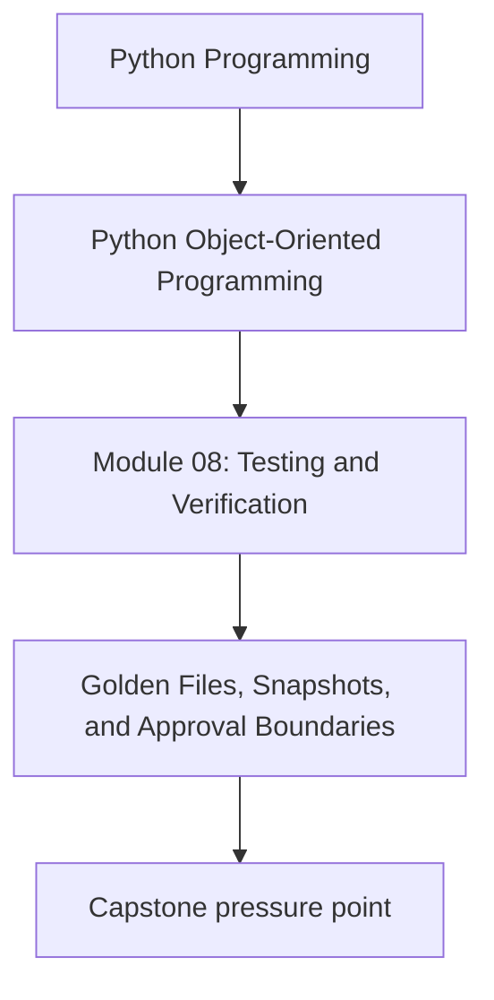
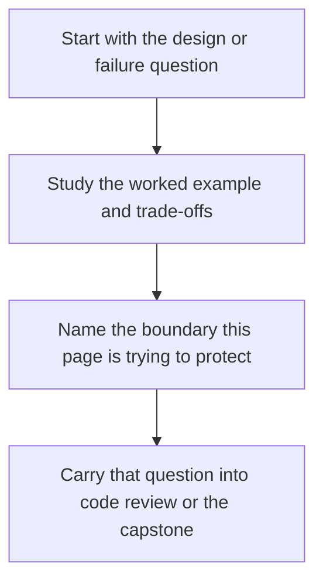

# Golden Files, Snapshots, and Approval Boundaries

<!-- page-maps:start -->
## Concept Position

<!-- page-maps:end -->

Read the first diagram as a placement map: this page is one concept inside its parent module, not a detached essay, and the capstone is the pressure test for whether the idea holds. Read the second diagram as the working rhythm for the page: name the problem, study the example, identify the boundary, then carry one review question forward.

## Purpose

Use snapshot-style tests carefully so they protect intentional public representations
instead of freezing noisy internal details.

## 1. Snapshot Tests Are Boundary Tests

They are most useful for outputs whose exact shape matters:

- serialized payloads
- public CLI text
- generated documents
- stable debug views

They are weak when applied to arbitrary object internals.

## 2. Stable Representation Is a Prerequisite

If field order, timestamps, or random identifiers drift on every run, snapshot tests
create churn instead of confidence. Normalize unstable elements first.

## 3. Review the Snapshot like a Public Contract

A changed golden file should be read as "did our external promise change?" not just
"approve the diff because the test failed."

## 4. Keep Snapshot Scope Small

Large snapshots are hard to review and encourage accidental approvals. Prefer one
focused public artifact over a huge dump of unrelated details.

## Practical Guidelines

- Snapshot only stable, reviewable boundary outputs.
- Normalize timestamps, ordering, and other noisy fields.
- Keep snapshot files small enough to review meaningfully.
- Treat snapshot updates as contract review, not routine maintenance.

## Exercises for Mastery

1. Identify one public output that deserves a golden-file test.
2. Remove one snapshot that is freezing internal noise instead of a real contract.
3. Add normalization for one unstable field before snapshotting.
